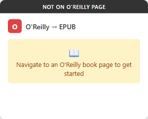
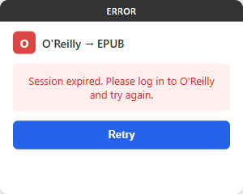

# O'Reilly EPUB Exporter

A Chrome extension that converts O'Reilly Learning books into EPUB format with a single click, optimized for e-ink readers (Boox).

## Features

- One-click conversion of entire O'Reilly books to EPUB 3.0
- Rich book metadata (language, publisher, subjects, description, publication date) for Calibre and e-reader libraries
- Cover always included: filename detection with an automatic API fallback for books without a conventionally named cover image
- Unicode-safe filenames — CJK and accented book titles are preserved instead of stripped
- E-ink optimized code blocks (typographic highlighting instead of color-based)
- Retains all images in original quality
- EPUB 2 NCX fallback for maximum reader compatibility
- Runs entirely in the browser — no backend server required
- Output validated against epubcheck (0 errors)

## Prerequisites

- Google Chrome (or Chromium-based browser)
- An active [O'Reilly Learning](https://learning.oreilly.com) subscription

## Installation

1. Clone this repository (or download the packaged zip from the [latest release](https://github.com/ludengz/oreillybook-epub-exporter/releases)):
   ```bash
   git clone https://github.com/ludengz/oreillybook-epub-exporter.git
   ```
2. Open Chrome and navigate to `chrome://extensions/`
3. Enable **Developer mode** (toggle in the top-right corner)
4. Click **Load unpacked** and select the `oreilly-epub-extension` directory

## Usage

1. Navigate to any book page on `learning.oreilly.com`
2. Click the extension icon — the popup will display the detected book title and author(s)
3. Click **Download EPUB**
4. The extension fetches all chapters, images, and stylesheets, then packages them into an EPUB file
5. The EPUB file downloads automatically when complete

## Popup States

| Not on O'Reilly | Book Detected | Downloading | Error |
|:---:|:---:|:---:|:---:|
|  |  |  |  |
| Navigate to an O'Reilly book page | Shows title & author, ready to download | Progress bar with chapter/image counts | Session expired or fetch failure |

## How It Works

- **Content script** runs on `learning.oreilly.com`, fetching book content via same-origin API calls (session cookies are included automatically)
- **Book metadata** (title, authors, language, publisher, subjects, description, publication date, cover URL) is retrieved from the O'Reilly search API (`/api/v2/search/`) and normalized before entering the EPUB
- **File manifest** is fetched from `/api/v2/epubs/` with pagination support
- **Service worker** relays progress messages, updates the extension badge, and proxies cover/CDN image fetches behind an O'Reilly host allowlist
- **JSZip** packages everything into a valid EPUB 3.0 file

## Project Structure

```
oreilly-epub-extension/
├── manifest.json          # Chrome Extension Manifest V3
├── content.js             # Main orchestration — fetching, parsing, EPUB assembly
├── background.js          # Service worker — message relay, badge, notifications
├── popup.html/js/css      # Extension popup UI
├── lib/
│   ├── jszip.min.js       # EPUB packaging
│   ├── path-utils.js      # Pure helpers: path resolution, filename sanitizing, host allowlist
│   ├── epub-builder.js    # EPUB structure generation (OPF, NCX, TOC) + metadata normalization
│   ├── fetcher.js         # HTTP fetching with retry, backoff, rate limit handling
│   └── eink-optimizer.js  # E-ink code block optimization
├── styles/
│   └── eink-override.css  # E-ink display overrides injected into EPUB
├── icons/                 # Extension icons
└── tests/                 # Browser-based test runner
```

## Testing

Tests run in a real browser (no Node.js test runner):

```bash
# Serve the repository root, then open the runner
python -m http.server 8765
# → http://localhost:8765/oreilly-epub-extension/tests/test-runner.html
```

The suite covers pure helpers, the download lifecycle (via a chrome API mock), and an integration pass that unpacks generated EPUBs to audit OPF/ZIP consistency.

## Design

See the full design spec at [`docs/superpowers/specs/2026-03-15-oreilly-epub-chrome-extension-design.md`](docs/superpowers/specs/2026-03-15-oreilly-epub-chrome-extension-design.md).

## Disclaimer

This extension requires an active O'Reilly Learning subscription. Downloaded EPUB files are **strictly for personal use only** — they must not be redistributed, shared, or used for any commercial purpose. Users are responsible for complying with O'Reilly's [Terms of Service](https://www.oreilly.com/terms/) and applicable copyright laws. This project is not affiliated with or endorsed by O'Reilly Media.
