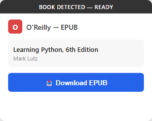
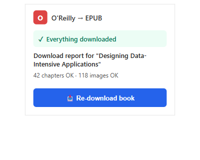
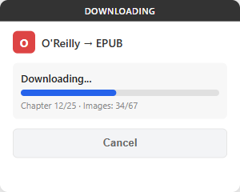
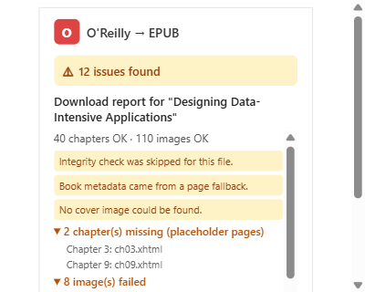

# O'Reilly EPUB Exporter

[](https://github.com/ludengz/oreillybook-epub-exporter/releases/latest)
[](LICENSE)


Turn any O'Reilly Learning book into a clean, e-ink-optimized EPUB in one click —
whether you pay for O'Reilly or read it **free through your public library**.

> Yes, really: many public and university library cards include the complete O'Reilly
> catalog, served through a library portal — and this extension runs there out of the box.
> Downloads are strictly for **personal use** — see the [Disclaimer](#disclaimer).

## Two ways to read O'Reilly, one extension

Most tools assume a personal `learning.oreilly.com` subscription. But a huge number of
libraries license the **entire O'Reilly catalog for free with a library card**, served
through an EZproxy gateway on a different hostname. This extension is built for both —
same one-click download, same quality report, same validated EPUB:

|  | Personal subscription | Library card |
|---|---|---|
| **Cost to you** | O'Reilly subscription | **free** with your library card |
| **Where you read** | `learning.oreilly.com` | your library's O'Reilly portal (EZproxy) |
| **Works out of the box** | yes | yes — Seattle Public Library |
| **Other libraries** | — | a [two-line edit](#adding-another-library) |
| **One-time setup quirk** | none | one Chrome ["Safety warning" click-through](#chrome-shows-a-safety-warning-the-first-time) |

Session expiry is even diagnosed per mode — a library user is told to sign back in through
the library portal, **not** to "log in to O'Reilly".

<p align="center">
  
  &nbsp;
  
</p>

## Features

**Built for e-ink readers**
- Code blocks restyled for grayscale: typographic emphasis instead of color-based syntax highlighting
- All images kept at original quality; EPUB 2 NCX fallback so older readers (tested on Boox) handle the TOC
- Output validates clean in epubcheck 5.1.0 — **0 errors**

**Nothing goes missing silently** ([see it](#popup-states))
- Quality report after every download: missing chapters, failed images, and stylesheet problems are counted and listed, with one-click re-download
- Pre-packaging integrity gate (OPF ↔ ZIP ↔ spine reconciliation) — a structurally broken EPUB is blocked, never delivered
- Handles both classic XHTML books and O'Reilly's **newer HTML-fragment format** (`epub:type` structural semantics preserved); cover always included via an API fallback

**A first-class citizen in your Calibre library**
- Rich metadata: language, publisher, subjects, description, publication date
- Unicode-safe filenames — CJK and accented titles survive intact
- Runs entirely in your browser against your own session — no backend, no third-party servers

## Install (about a minute, no build step)

You need Chrome (or any Chromium browser) and access to O'Reilly Learning — a personal
subscription **or** a library that provides it (see [Library access](#library-access)).

1. Download `oreilly-epub-exporter-x.y.z.zip` from the
   [latest release](https://github.com/ludengz/oreillybook-epub-exporter/releases/latest) and unzip it.
2. Open `chrome://extensions/` and turn on **Developer mode** (top-right toggle).
3. Click **Load unpacked** and select the unzipped `oreilly-epub-extension` folder.

The extension isn't distributed through the Chrome Web Store, so it installs via Chrome's
standard developer-mode flow. There is no build step and no server — what you unzip is the
complete, readable source.

<details>
<summary>Install from source instead</summary>

```bash
git clone https://github.com/ludengz/oreillybook-epub-exporter.git
```

Then Load unpacked → select `oreilly-epub-extension/`.
</details>

## Usage

1. Open any book — on `learning.oreilly.com`, or through your library's O'Reilly portal.
   *(Library users: if Chrome shows a red "Safety warning" on your library's link, see the
   [one-time click-through](#chrome-shows-a-safety-warning-the-first-time) below.)*
2. Click the extension icon — the popup shows the detected book title and author(s).
3. Click **Download EPUB**.
4. The extension fetches all chapters, images, and stylesheets, then packages them into an EPUB.
5. The file downloads automatically when complete, followed by a per-book quality report.

### Popup States

| Book Detected | Downloading | Quality Report | Report with issues |
|:---:|:---:|:---:|:---:|
|  |  |  |  |
| Title & author, ready to download | Progress with live chapter/image counts | "Everything downloaded" | Exactly what failed, with retry |

## Library access

Many public and university libraries provide O'Reilly Learning through an
[EZproxy](https://help.oclc.org/Library_Management/EZproxy) gateway, which serves the same
content from a rewritten hostname — `learning.oreilly.com` becomes
`learning-oreilly-com.<proxy-host>`. The extension supports this natively.

**Didn't know your library card could include the full O'Reilly catalog?** Many do — search
your library's "databases" or "e-resources" page for "O'Reilly".

**Out of the box:** Seattle Public Library (`learning-oreilly-com.ezproxy.spl.org`).

### Chrome shows a "Safety warning" the first time

Chrome's lookalike-domain heuristic sees a well-known domain embedded in a subdomain and
flags it. The hyphenated shape is exactly what EZproxy must produce to match its wildcard
TLS certificate, so the warning is a false positive — but Chrome cannot know that, and
**the extension cannot run while the warning is on screen**.

Click **Details → Continue to \<host\> (unsafe)** once. Chrome remembers the choice for that
site. This happens even when you follow your library's own link.

### Adding another library

Two files, one hostname:

1. `oreilly-epub-extension/manifest.json` — add `https://learning-oreilly-com.<your-proxy-host>/*`
   to `host_permissions` and `web_accessible_resources[0].matches`, and both `/library/view/*`
   and `/library/cover/*` variants to `content_scripts[0].matches`.
2. `oreilly-epub-extension/lib/path-utils.js` — add the same hostname to `PathUtils.ALLOWED_IMAGE_HOSTS`.

Then reload the unpacked extension. A test (`tests/path-utils.test.js`) fails if you update
one file and forget the other.

To find your hostname, open a book through your library and read the address bar.

### What is not supported

- **Proxy-by-port** gateways (`https://ezproxy.example.org:2443/...`) and http-only proxies.
- Rewriting proxies other than EZproxy (WAM, MUSE) may work if you declare their hostname, but are untested.
- **OpenAthens / institutional SSO needs no changes**: those log you in on the real
  `learning.oreilly.com`, which the extension already supports.

The personal-use disclaimer below applies to library access too. Check your library's terms.

## How It Works

- **Content script** runs on `learning.oreilly.com` and the declared library-proxy hosts,
  fetching book content via same-origin API calls (session cookies — O'Reilly's or your
  library's — are included automatically)
- **Book metadata** (title, authors, language, publisher, subjects, description, publication
  date, cover URL) is retrieved from the O'Reilly search API and normalized before entering the EPUB
- **Session expiry** is detected in both modes — including EZproxy's login redirect, which is
  invisible to a naive fetch — and reported with mode-specific recovery guidance
- **Service worker** relays progress, updates the badge, and proxies cover/CDN image fetches
  behind a host allowlist covering both origins
- **JSZip** packages everything into a valid EPUB 3.0 file

<details>
<summary>For developers — project structure, testing, design spec</summary>

### Project Structure

```
oreilly-epub-extension/
├── manifest.json          # Chrome Extension Manifest V3
├── content.js             # Main orchestration — fetching, parsing, EPUB assembly
├── background.js          # Service worker — message relay, badge, notifications
├── popup.html/js/css      # Extension popup UI
├── lib/
│   ├── jszip.min.js       # EPUB packaging
│   ├── path-utils.js      # Pure helpers: path resolution, filename sanitizing, host allowlist
│   ├── epub-builder.js    # EPUB structure generation (OPF, NCX, TOC) + metadata normalization
│   ├── epub-validator.js  # Pre-package integrity gate (manifest/ZIP/spine reconciliation)
│   ├── fetcher.js         # HTTP fetching with retry, backoff, session-expiry detection
│   └── eink-optimizer.js  # E-ink optimization + XHTML namespace repair
├── styles/
│   └── eink-override.css  # E-ink display overrides injected into EPUB
├── icons/                 # Extension icons
└── tests/                 # Browser-based test runner
```

### Testing

Tests run in a real browser (no Node.js test runner):

```bash
# Serve the repository root, then open the runner
python -m http.server 8765
# → http://localhost:8765/oreilly-epub-extension/tests/test-runner.html
```

The suite covers pure helpers, the download lifecycle (via a chrome API mock), and an
integration pass that unpacks generated EPUBs to audit OPF/ZIP consistency — including
fixtures that run the full pipeline against a simulated library-proxy origin.

### Design

See the full design spec at
[`docs/superpowers/specs/2026-03-15-oreilly-epub-chrome-extension-design.md`](docs/superpowers/specs/2026-03-15-oreilly-epub-chrome-extension-design.md).

</details>

---

If this put your library's O'Reilly catalog on your e-reader, a ⭐ helps other readers find it.

## License

[MIT](LICENSE) © Ludeng Zhao. The code is fully open and auditable — what you unzip is what runs.

## Disclaimer

This extension requires legitimate access to O'Reilly Learning — a personal subscription or a
library that provides it. Downloaded EPUB files are **strictly for personal use only** — they
must not be redistributed, shared, or used for any commercial purpose. Users are responsible
for complying with O'Reilly's [Terms of Service](https://www.oreilly.com/terms/), your
library's terms of use, and applicable copyright laws. This project is not affiliated with or
endorsed by O'Reilly Media.
