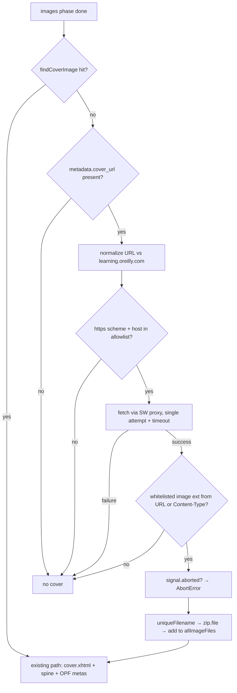

# feat: Rich OPF Metadata, API Cover Fallback, and Unicode-Safe Filenames

## Overview

Three related improvements to the EPUB output, all fed by data the extension already fetches but discards:

1. **Unicode-safe filenames** — the current sanitizer strips CJK/accented book titles to an empty string, producing files named `.epub`.
2. **Rich OPF metadata** — `dc:language` is hardcoded `'en'`; `language`, `publishers`, `description`, `issued`, and `subjects` from the search API response are thrown away.
3. **API cover fallback** — when the filename heuristic (`findCoverImage`) finds no cover, use the API's `cover_url` instead of shipping a coverless book.

Hard constraint throughout: generated EPUBs must keep passing epubcheck with 0 errors (baseline: epubcheck 5.1.0, established in commit c9bad25).

## Problem Frame

No upstream requirements document exists; this plan derives from ideation idea #3 (see origin doc) plus a planning bootstrap:

- **Problem**: Non-English books produce unrecognizable/empty filenames (100% reproducible for CJK titles); wrong `dc:language` breaks hyphenation and dictionary lookup on Boox/Kobo; poor metadata makes books "orphans" in Calibre/device libraries; books without a conventionally-named cover image show as gray blocks on e-ink shelves.
- **Intended behavior**: Filenames preserve the human-readable title (minus filesystem-illegal characters) and never come out empty; the OPF carries whatever real metadata the API provides; a cover is present whenever either the heuristic or the API can supply one.
- **Success criteria**: see Requirements Trace. All failure modes degrade gracefully (existing convention: warn and continue, never fail the whole download for an optional asset).

## Requirements Trace

- R1. A book with a CJK/accented/punctuation-heavy title downloads with a recognizable filename; an empty sanitized result falls back to `book-{isbn}.epub`.
- R2. The OPF emits `dc:language` from the API (validated, `'en'` fallback) and `dc:publisher`/`dc:description`/`dc:date`/`dc:subject` when available; absent fields are omitted entirely (no empty elements); epubcheck stays at 0 errors.
- R3. When `findCoverImage` returns null and the API provides a usable `cover_url`, the EPUB gets a cover with full parity to the heuristic path (manifest item with `properties="cover-image"`, EPUB2 `<meta name="cover">`, `cover.xhtml` first in spine); any failure degrades to a coverless but valid EPUB.
- R4. All existing tests (79 at time of writing) keep passing; the `findCoverImage` heuristic and its locked tests are untouched.
- R5. Metadata is fetched at most once per book per page session (memoized by ISBN, successful responses only) — fixes the known duplicate `fetchBookMetadata` call.

## Scope Boundaries

- No transliteration/pinyin conversion of filenames — strip illegal characters only (origin doc direction).
- No changes to the `findCoverImage` heuristic or its test assertions; the API cover is strictly a fallback.
- No DOM scraping for metadata; the search API remains the only source (hard constraint). Parsing the book's original OPF stays rejected (2026-04-05 ideation rejection #6).
- No popup/UI changes; the `bookDetected` message payload shape stays frozen.
- No SPA route re-detection (ideation idea #4, separate work) — Unit 2 adds a `redetectBook` message action as shared groundwork and as the test harness's entry point for detection scenarios, but nothing auto-invokes it on navigation; the memoization design must not make that problem worse (keyed by ISBN, so a different book never hits a stale cache entry).
- No retry/backoff machinery for the cover fetch (single attempt with timeout; it is an optional asset).

## Context & Research

### Relevant Code and Patterns

- `oreilly-epub-extension/content.js` — `fetchBookMetadata` (keeps only title/authors; failure falls back to `document.title` parsing); metadata object construction in `buildEpub` (hardcodes `language: 'en'`; `modified` deliberately millisecond-stripped for epubcheck); filename sanitize + anchor-click download; cover heuristic call site (cover.xhtml generated and unshifted into `chapters`, entering spine/toc/NCX).
- `oreilly-epub-extension/lib/epub-builder.js` — pure string-generation module. `_escapeXml` escapes `& < > "` (used for title/creators/toc labels; **not** currently applied to `language`); `findCoverImage` two-tier word-boundary heuristic; `generateOpf(metadata, chapters, images, cssFiles, coverImageFilename)` emits `properties="cover-image"` + EPUB2 `<meta name="cover">` with deduped manifest ids (`uniqueId`); `_mimeType` falls back to `application/octet-stream` for unknown extensions.
- `oreilly-epub-extension/lib/path-utils.js` — home of shared pure helpers (`stripQueryAndHash`, `createUniqueNamer`, ...). Already first in the content-script load order; adding a method requires **no** manifest.json change.
- `oreilly-epub-extension/background.js` — `fetchImage` CORS proxy handler: SW-context `fetch(url, {credentials:'include'})` → base64 roundtrip (ArrayBuffer can't cross the message channel). No URL filtering in the handler; `manifest.json` `host_permissions` (`learning.oreilly.com`, `*.oreillystatic.com`, `*.safaribooksonline.com`) only exempts SW fetches from CORS for those origins — hosts outside it can still be fetched when the server sends permissive CORS headers, so the content-side allowlist this plan adds is the actual enforcement point for cover URLs.
- Tests: three layers — pure-function unit tests (`tests/path-utils.test.js`, `tests/epub-builder.test.js`), chrome-mock lifecycle tests (`tests/content-lifecycle.test.js`, `tests/background-state.test.js`), and the ZIP-audit integration test (`tests/epub-compliance.test.js`, which mocks `window.fetch`, intercepts the download anchor click, unpacks the blob with JSZip, and audits manifest↔ZIP consistency). New test files must be added to `tests/test-runner.html`'s script list; `tests/chrome-mock.js`'s `runtime.sendMessage` currently always responds `{ok: true}` with no data.

### Institutional Learnings

- **Orphan-resource invariant** (c9bad25 incident): every file written into the ZIP must be declared in the OPF manifest — and conversely, never account for a file that wasn't actually written. The compliance test audits this.
- **Manifest id collisions**: `_sanitizeId` collapses `cover.png`/`cover.jpg` to the same id; `uniqueId` dedupe exists at the id layer, but the ZIP path layer relies on `createUniqueNamer` — a fallback cover named like an existing image must go through the same namer, and the namer's return value must be used consistently everywhere it's referenced.
- **Cover heuristic history**: the original `/cover/i` substring match false-positived on `recovery-diagram.png`; the current word-boundary version has locked tests. Don't touch it.
- **Boox dual-write**: covers need both EPUB3 `properties="cover-image"` and EPUB2 `<meta name="cover" content="{id}"/>`.
- **Date format sensitivity**: `dcterms:modified` already needs millisecond-stripping for epubcheck; `dc:date` from an API `issued` field will have the same class of problem.
- **Entity/serialization lessons** (af2636a, 2ba6898): HTML content must be handled via DOM parsing, never regex string surgery.
- **Query/hash stripping** (af2636a): URLs must be cleaned before deriving filenames.

### External References

- None — external research skipped: local patterns are strong (the OPF template already passes epubcheck; escaping, date-format, and dedupe precedents all exist in-repo).

## Key Technical Decisions

- **Filename policy — preserve, don't transform**: `PathUtils.sanitizeFilename(name, fallback)` replaces filesystem-illegal characters (`\ / : * ? " < > |`), C0/C1 control characters, and zero-width/format characters with spaces, collapses whitespace runs to a single space, trims leading/trailing dots and spaces (Windows), rejects Windows reserved device names (`CON`, `PRN`, `AUX`, `NUL`, `COM1-9`, `LPT1-9`, case-insensitive), caps the stem so the full filename stays within ~200 UTF-8 **bytes** (byte-aware, not code-point — ext4's limit is 255 bytes and 120 CJK code points already exceed it; re-trim after truncation, never splitting a code point), and returns `fallback` when the result is empty. Unicode, case, and spaces are **preserved** — this intentionally changes existing ASCII output from `some-title.epub` to `Some Title.epub`. Rationale: recognizability on device file managers was the original complaint; the origin doc directs "strip filesystem-illegal characters only." Chromium's download pipeline does sanitize illegal characters, reserved names, and length on its own — the helper is kept because it provides what the browser cannot: deterministic cross-platform output that tests can assert exactly, zero-width/RTL-override stripping, and the empty-result → `book-{isbn}` fallback; Chrome's sanitizer remains the second net.
- **Date normalization is string-level, never `Date`-roundtripped**: extract an ISO prefix (`YYYY`, `YYYY-MM`, or `YYYY-MM-DD`) by regex from the API `issued` value and range-check the extracted components (month 01-12, day 01-31) so values like `2023-13` are omitted rather than drawing an epubcheck OPF-053 warning; emit the result as `dc:date`; omit the element on any miss. Rationale: `Date` parsing introduces timezone drift (`2023-05-09` → `2023-05-08` locally) and Chrome's lenient `Date.parse` accepts strings like `"May 2023"`, defeating "omit if unparseable."
- **Language validation via `Intl.getCanonicalLocales` + short-subtag requirement**: after the string type-guard (`Intl.getCanonicalLocales(42)` returns `[]` without throwing — the try/catch alone is not the guard), take the first element if the API returns an array, canonicalize with `try { Intl.getCanonicalLocales(tag) } catch { → fallback }`, then require the canonicalized tag's primary language subtag to be 2-3 alpha characters (ISO 639-1/2 form). The structural check rejects ill-formed tags (`en-a`, `en-US-GB`) that epubcheck 5 flags as OPF-092 **errors**; the short-subtag requirement rejects natural-language names like `english`/`german`, which are RFC 5646 well-formed (5-8-alpha primary subtags) and therefore pass `Intl` alone. Emit the **canonicalized** output (normalizes casing, e.g. `EN-us` → `en-US`, and applies CLDR aliases); anything failing either check falls back to `'en'`. `dc:language` is API-sourced, so it goes through `_escapeXml` like every other new field.
- **One normalization layer, in the builder**: a pure `EpubBuilder.normalizeMetadata(raw, fallbacks)`-style helper converges untrusted API shapes into a clean metadata object — type-guard every field (list-valued fields — `subjects` and `publishers` — accept a bare string or an array of strings/`{name}` objects, converging to a deduped string array with one `dc:subject`/`dc:publisher` element emitted per entry; scalar fields accept strings only; anything else is dropped), treat empty strings/arrays as absent, strip XML-1.0-illegal code points (U+0000–U+0008, U+000B/C, U+000E–U+001F) from all text, and extract description plain text via DOMParser with block-level tags mapped to spaces (naive `textContent` glues `<p>A</p><p>B</p>` into `AB`). Rationale: lives in `lib/` → directly unit-testable, no manifest/load-order change; `generateOpf` stays a dumb template over trusted input; `_escapeXml` remains unchanged (it would throw on non-strings — the normalization layer guarantees strings).
- **Memoize successful metadata fetches only, keyed by ISBN**: `detectBook` and `buildEpub` share one cached promise per ISBN; a rejected/fallback result is evicted so the download-time call retries. Rationale: `detectBook` runs at injection time when the SPA's `document.title` may not be ready — caching a failure would freeze a bad title AND permanently disable the cover fallback (no `cover_url`). Consumer-side backstop for the promise-join race: a caller that awaits an already-in-flight fetch can receive a fallback-shaped result before eviction runs, so `buildEpub` treats a fallback-shaped resolution as a cache miss and refetches once — R5's duplicate-fetch elimination holds on the happy path, and the rare bad-value path costs one extra request instead of freezing a bad title into the OPF.
- **Cover fallback decision chain fails closed**: heuristic first; then require `cover_url`, normalize it against `https://learning.oreilly.com` (handles relative/protocol-relative values), require the `https:` scheme, and require the hostname to match the `host_permissions`-derived allowlist — exact equality for `learning.oreilly.com`; for the wildcard patterns, exact-or-dot-suffix matching (hostname equals `oreillystatic.com`/`safaribooksonline.com` or ends with `.oreillystatic.com`/`.safaribooksonline.com`), never substring/`includes()` matching, which a host like `oreillystatic.com.evil.example` would defeat. Then require a whitelisted image type (`jpg/jpeg/png/gif` — WebP excluded on this new path only for older-reader compatibility; the untouched heuristic path keeps shipping whatever the publisher packaged, an accepted asymmetry since that is existing, test-locked behavior): the response `Content-Type` (media-type parameters such as `; charset=` stripped before matching) **takes precedence** when present — it describes the actual served bytes, which is what epubcheck's OPF-029 signature check compares against — and the query-stripped URL extension is only the fallback when `Content-Type` is absent or unusable; both unusable → skip cover entirely rather than ship an `application/octet-stream` cover (epubcheck error). The fallback cover's ZIP filename extension is always (re-)derived from the **effective** media type — `Content-Type` when present, URL extension otherwise — because `generateOpf` derives the OPF media-type from the filename via `_mimeType`; a `.png` URL serving `Content-Type: image/jpeg` must be stored as `.jpg`, or the OPF declares `image/png` over JPEG bytes (epubcheck OPF-029 error). Single fetch attempt with a ~10-15s timeout, no retry.
- **`fetchImage` response gains an optional `contentType` field**: additive change to the background handler; content side treats it as optional (tolerates dev-time version skew between reloaded content script and stale SW).
- **Defense-in-depth: the `fetchImage` handler enforces the same scheme + host allowlist**: the privileged component that performs the credentialed, CORS-exempt fetch validates the URL itself (same match rule as the content side) instead of trusting a single caller-side gate. Deliberate side effect: existing Strategy-4 chapter-image fetches to hosts outside the three O'Reilly domains are now rejected (rare; accepted as hardening — those images fall through to the existing warn/missing-image degradation). The match rule is implemented **once** as a pure helper in `lib/path-utils.js`; `background.js` loads it via guarded `importScripts` (`if (typeof importScripts === 'function') importScripts('lib/path-utils.js')`) — in the real MV3 service worker the guard passes and the shared implementation loads; in the test-runner page (which loads `background.js` via a script tag) `importScripts` is undefined but `PathUtils` already exists from the earlier script tag, so both contexts call the identical function and the allowlist cannot drift. Do not derive the list from `chrome.runtime.getManifest()` — `tests/chrome-mock.js` does not stub it.
- **Account-after-write, one name everywhere**: the fallback cover is added to `allImageFiles` only after `zip.file(...)` succeeds, and the single `uniqueFilename(...)` return value is used for the ZIP path, `allImageFiles`, and the `coverImageFilename` passed to `generateOpf`/`generateCoverXhtml`.
- **Abort-safety**: check `signal.aborted` after the cover fetch resolves and before `generateOpf` (the post-chapter-loop window currently has no checks; the cover fetch widens it). The SW-side fetch itself is not abortable — discarding the result is acceptable.
- **`bookDetected` payload frozen**: `detectBook` keeps sending only the current `{isbn, title, authors}` shape to the service worker (popup does `authors.join(', ')` and would crash on new shapes; the SW persists this object per tab, and the queue design in ideation idea #7 depends on per-tab `isbn`); rich fields stay internal to the content script.

## Open Questions

### Resolved During Planning

- Filename style (spaces/case vs. legacy kebab-lowercase): preserve original title text — see Key Technical Decisions.
- `dc:date` handling: string-level ISO-prefix extraction, omit otherwise.
- Language validation depth: `Intl.getCanonicalLocales` canonicalization + 2-3-alpha primary-subtag requirement, emitting the canonicalized tag, `'en'` fallback (revised from an initial syntax-regex decision during document review — the regex admitted ill-formed tags, and `Intl` alone admits `english`).
- epubcheck baseline: 5.1.0 (the c9bad25 baseline); manual run remains the final gate, with proxy assertions (date prefix + range rule, `Intl`-based language validation, no illegal code points) added to the in-browser compliance test.
- Where normalization lives: `lib/epub-builder.js` (testability, no manifest change).

### Deferred to Implementation

- **Live search API response shape** — exact field names/types for `language`, `publishers`, `description`, `issued`, `subjects`, `cover_url`, and whether the response carries an ISBN/identifier usable to detect fuzzy-search mismatches (the query is a fuzzy search; `results[0]` may be a different book, and a wrong cover is far more visible than a wrong title). Verify with one real logged-in request at the start of Unit 2; the normalization layer is designed defensively so surprises narrow behavior rather than break it.
- **`cover_url` host vs. `host_permissions`** — if live verification shows covers served from a host outside the current three patterns, add that host to `manifest.json` `host_permissions` only if it meets the acceptance criteria (exact hostname preferred over a wildcard; verified O'Reilly-operated CDN); if it's unpredictable or fails the criteria, the fail-closed chain simply skips those covers.
- Exact helper names/signatures — implementer's choice within the decisions above.

## High-Level Technical Design

> *This illustrates the intended approach and is directional guidance for review, not implementation specification. The implementing agent should treat it as context, not code to reproduce.*

Metadata pipeline (Unit 2):

```
search API response ──▶ fetchBookMetadata (keep rich fields; memoize success by ISBN)
                              │
                              ▼
        EpubBuilder.normalizeMetadata (type-converge, strip illegal codepoints,
        validate language, ISO-prefix date, DOMParser-flatten description)
                              │
                              ▼
        metadata object ──▶ generateOpf (emit optional dc:* elements, all through _escapeXml)
```

Cover decision chain (Unit 3):



## Implementation Units

- [x] **Unit 1: Unicode-safe filename sanitization**

**Goal:** Book titles survive into the download filename; the filename is never empty.

**Requirements:** R1, R4

**Dependencies:** None

**Files:**
- Modify: `oreilly-epub-extension/lib/path-utils.js` (add `sanitizeFilename`)
- Modify: `oreilly-epub-extension/content.js` (replace the inline sanitizer in the download-trigger block; pass `book-{isbn}` as fallback)
- Test: `oreilly-epub-extension/tests/path-utils.test.js`

**Approach:**
- Pure helper per the filename policy decision; `content.js` becomes a one-line call site. No manifest.json change (path-utils already loads first).

**Patterns to follow:**
- Existing `PathUtils` pure-function style and its test file's `describe`/`assertEqual` conventions.

**Test scenarios:**
- Happy path: CJK title `深入理解计算机系统` → stem unchanged; accented `Café Sécurité` → unchanged; `Designing Data-Intensive Applications` → unchanged (documents the intentional style change from kebab-lowercase).
- Happy path: illegal characters replaced with spaces and collapsed — `C++: Design/Use?` → `C++ Design Use`.
- Edge case: title that is only illegal characters/punctuation (`"???"`) → returns fallback `book-9781234567890`.
- Edge case: empty/whitespace-only title → fallback.
- Edge case: Windows reserved name (`con`, `COM7`) → fallback.
- Edge case: trailing dots/spaces (`Title...`) → trimmed; leading dots (`.hidden`) → trimmed.
- Edge case: title exceeding the ~200-UTF-8-byte cap (e.g., a long CJK title) → truncated byte-aware without splitting a code point, then re-trimmed (no trailing space/dot after cut).
- Edge case: zero-width space (U+200B), RTL override (U+202E), and C0 control chars → removed.

**Verification:**
- New path-utils tests pass alongside the existing suite in `tests/test-runner.html`; a manual download of a CJK-titled book produces a recognizable `.epub` filename.

- [x] **Unit 2: Rich metadata pipeline (fetch → normalize → OPF)**

**Goal:** The OPF carries real language/publisher/description/date/subjects from the API; metadata is fetched once per book; malformed API data can never break XML well-formedness or epubcheck compliance.

**Requirements:** R2, R4, R5

**Dependencies:** None (parallel to Unit 1)

**Execution note:** Before wiring field mappings, capture one real search API response for a known book (logged-in session) and confirm field names/shapes, `cover_url` presence, host, and served `Content-Type`, and whether an identifier field allows fuzzy-match detection. This is the plan's main deferred unknown. Test isolation: the metadata memo persists for the entire test-runner page session, so Unit 2's eviction and frozen-payload scenarios must use fresh ISBNs not shared with existing fixtures (9781111111111 in content-lifecycle, 9782222222222 in compliance) — or use a test-visible memo reset in setup.

**Files:**
- Modify: `oreilly-epub-extension/content.js` (`fetchBookMetadata` returns rich fields; ISBN-keyed success-only memoization; `buildEpub` metadata construction delegates to the normalizer; `detectBook` payload to SW stays `{isbn, title, authors}`; new `redetectBook` message action that re-runs `detectBook` — production-legitimate groundwork for SPA re-detection and the test entry point for detection scenarios)
- Modify: `oreilly-epub-extension/lib/epub-builder.js` (`normalizeMetadata` helper; `generateOpf` emits optional `dc:publisher`/`dc:description`/`dc:date`/`dc:subject` elements and escapes `dc:language`)
- Test: `oreilly-epub-extension/tests/epub-builder.test.js` (normalizer + OPF emission)
- Test: `oreilly-epub-extension/tests/content-lifecycle.test.js` (frozen `bookDetected` payload shape — currently untested)
- Test: `oreilly-epub-extension/tests/epub-compliance.test.js` (proxy assertions: `dc:date` matches the ISO-prefix + range rule when present, `dc:language` validates via `Intl.getCanonicalLocales`, OPF contains no XML-illegal code points)

**Approach:**
- Per the normalization-layer and memoization decisions. `generateOpf` template extends the existing metadata block; omitted fields produce no element at all.

**Patterns to follow:**
- `_escapeXml` usage as for `dc:title`/`dc:creator`; millisecond-stripping precedent for date discipline; DOMParser-over-regex convention for anything HTML.

**Test scenarios:**
- Happy path: full rich API response → OPF contains escaped `dc:language`, `dc:publisher`, `dc:description`, `dc:date`, one `dc:subject` per subject.
- Happy path: minimal response (title/authors only) → OPF identical in shape to today's output (no empty elements).
- Edge case: language `en-US` → kept; `EN-us` → canonicalized `en-US`; `english` / `en-a` / `en-US-GB` / `[]` / `42` → `'en'` (Intl canonicalization + 2-3-alpha primary-subtag requirement); array `['ja', 'en']` → `ja`.
- Edge case: issued `2023-05-09T00:00:00Z` → `dc:date` `2023-05-09`; `May 2023` → element omitted; `2023-05` → kept as-is (no timezone drift — string-level assertion); `2023-13` → omitted (range check).
- Edge case: description containing `<p>`/`<b>` HTML and entities → tags stripped with block boundaries becoming spaces (`<p>A</p><p>B</p>` → `A B`), then XML-escaped (`&` → `&amp;`).
- Edge case: subjects as `{name: 'Java'}` objects, as strings, mixed with nulls → converged to unique strings, junk dropped.
- Edge case: publishers as `["O'Reilly Media, Inc."]` array, as a bare string, or as `{name}` objects → one `dc:publisher` element per unique entry.
- Edge case: fields containing XML-illegal control characters (U+0008) → stripped before emission.
- Error path: non-string field values (numbers, objects) anywhere → no throw from `_escapeXml`, field treated per type-convergence rules.
- Error path: `detectBook`-time fetch fails (network) → fallback title used for the popup, cache **not** populated; the download-time call retries and succeeds → OPF gets rich fields (memo eviction semantics).
- Error path: `buildEpub` joins an in-flight injection-time fetch that resolves to the fallback shape → treated as a cache miss, one refetch issued (consumer-side backstop for the promise-join race).
- Integration: `bookDetected` message payload contains exactly the frozen shape (isbn string, title string, authors array) — popup contract regression guard (driven via the `redetectBook` action under a mocked environment; `detectBook` itself early-returns on the test-runner URL).
- Integration: compliance run's unpacked OPF passes the three proxy assertions.

**Verification:**
- All suites pass; a compliance-test OPF shows the new fields; behavior with the fixture's minimal metadata is byte-compatible with today's OPF metadata block except for intended additions.

- [x] **Unit 3: API cover fallback**

**Goal:** Books without a heuristic-detectable cover get the API cover with full parity to the heuristic path; every failure mode yields a valid, coverless EPUB.

**Requirements:** R3, R4

**Dependencies:** Unit 2 (needs `cover_url` plumbing and success-only memoization semantics)

**Execution note:** The metadata memo persists for the entire test-runner page session (content.js loads once for all suites), so every new compliance/lifecycle fixture must mock a distinct ISBN following the existing pattern (9781111111111 in content-lifecycle, 9782222222222 in the current compliance fixture) — or expose a test-visible memo reset used in test setup.

**Files:**
- Modify: `oreilly-epub-extension/content.js` (cover fallback branch after `findCoverImage`; abort checks; timeout on the proxy call)
- Modify: `oreilly-epub-extension/background.js` (`fetchImage` response gains optional `contentType`; handler-side scheme + host allowlist via guarded `importScripts('lib/path-utils.js')`)
- Modify: `oreilly-epub-extension/lib/path-utils.js` (shared scheme + host allowlist matcher — single source for both contexts)
- Test: `oreilly-epub-extension/tests/path-utils.test.js` (matcher: exact host, dot-suffix match, suffix-spoofing rejection, non-https rejection)
- Modify: `oreilly-epub-extension/tests/chrome-mock.js` (action-routed responder support so tests can serve `fetchImage` base64 payloads — today `sendMessage` always answers `{ok: true}` with no data)
- Test: `oreilly-epub-extension/tests/epub-compliance.test.js` (new scenarios below)
- Test: `oreilly-epub-extension/tests/background-state.test.js` (`fetchImage` returns data + contentType against a patched SW fetch)

**Approach:**
- Implement the decision chain from the design diagram; account-after-write with the single namer-returned filename; reuse the existing `generateCoverXhtml` + `chapters.unshift` + `generateOpf(coverImageFilename)` path so EPUB3/EPUB2 cover metas come for free.

**Patterns to follow:**
- Existing Strategy-4 proxy call site in `content.js` (absolute-URL convention, base64 decode); per-resource try/catch + `console.warn` degradation style; `PathUtils.stripQueryAndHash` before filename derivation.

**Test scenarios:**
- Happy path (compliance): fixture with **no** cover-named image + metadata carrying `cover_url` + mock responder serving a real tiny JPEG → unpacked EPUB has the cover in the manifest with `properties="cover-image"`, EPUB2 `<meta name="cover">` pointing at its id, `cover.xhtml` first in spine, and zero orphan/dangling entries.
- Happy path: heuristic hit (existing fixture) → no `fetchImage` message is ever sent (fallback not consulted).
- Error path (compliance): `cover_url` present but responder fails → download completes, EPUB valid, no cover items, no dangling `cover.xhtml`.
- Edge case: `cover_url` with `?v=123` query → derived filename is clean (query-stripped).
- Edge case: `cover_url` ends `.png` but responder serves `Content-Type: image/jpeg` → stored filename gets `.jpg` and the OPF declares `image/jpeg` (extension re-derived from the effective type).
- Edge case: extensionless `cover_url` + `contentType: image/jpeg` → `.jpg` filename; `contentType: image/jpeg; charset=binary` → parameters stripped, still `.jpg`; extensionless + missing contentType → cover skipped entirely (no octet-stream manifest entry).
- Edge case: cover basename collides with an existing image (`cover.jpg` already failed to download from the book manifest) → namer-unique filename used consistently in ZIP path, `allImageFiles`, OPF, and `cover.xhtml` src.
- Edge case: relative or protocol-relative `cover_url` → normalized against `learning.oreilly.com`; host outside the allowlist, suffix-spoofing host (`oreillystatic.com.evil.example`), or non-https scheme → skipped.
- Error path: cancel during the cover fetch → abort check throws before packaging; no `downloadComplete` message reaches the SW (guards the known cancel-then-complete badge race).
- Integration: `detectBook`-time metadata fetch failed but download-time fetch succeeded (memo eviction) → cover fallback still functional.
- Integration (background): patched SW fetch returning bytes + `Content-Type` header → handler responds `{ok, data, contentType}`; fetch failure → `{ok: false, error}`.
- Error path (background): handler itself rejects a non-allowlisted host (`https://evil.example/x.jpg`), a suffix-spoofing host, and a non-https scheme — defense-in-depth independent of the content-side gate.

**Verification:**
- New compliance scenarios pass; full suite green; manual end-to-end: download one real book lacking a cover-named image, run epubcheck 5.1.0 → 0 fatals / 0 errors / 0 warnings, cover visible in a reader (Boox spot-check optional).

## System-Wide Impact

- **Interaction graph:** popup and SW state are insulated — `bookDetected` payload frozen; `fetchImage` response change is additive (old callers ignore `contentType`), but the new handler-side allowlist intentionally narrows Strategy-4: chapter images hosted off the three O'Reilly domains are now rejected and degrade to the existing warn/missing-image path. No changes to progress, badge, or rate-limiting paths.
- **Error propagation:** all new failure modes (bad metadata fields, cover fetch failure, disallowed host, unknown media type) degrade to today's behavior (omit field / no cover) with `console.warn`; only `AbortError`/`SESSION_EXPIRED` keep propagating.
- **State lifecycle risks:** metadata memo is per-content-script-instance (cleared on page reload) and keyed by ISBN, so it cannot serve another book's data even before ideation idea #4 (SPA re-detection) lands; success-only caching prevents freezing injection-time fallback titles.
- **API surface parity:** none — no other interface renders filenames or OPF metadata.
- **Integration coverage:** compliance-test additions cover the two cross-layer paths unit tests can't prove (fallback cover threading through zip+OPF+spine; frozen `bookDetected` contract).
- **Unchanged invariants:** `mimetype` first ZIP entry (STORE); dual TOC (EPUB3 nav + EPUB2 NCX); `findCoverImage` heuristic and its locked tests; four-strategy chapter-image fallback; 2-per-batch/1s rate limiting; metadata-via-API (no DOM scraping).

## Risks & Dependencies

| Risk | Mitigation |
|------|------------|
| `cover_url` absent from the API response or served from a non-permitted host | Live verification at Unit 2 start; fail-closed decision chain means worst case is status quo (no cover); extend `host_permissions` only if verification shows a stable extra host |
| Fuzzy search returns a different book (`results[0]` mismatch) — wrong cover is highly visible | During live verification, check for an identifier field to compare against the URL ISBN; if present, distrust rich fields on mismatch; if absent, accept the (pre-existing) residual risk — today's title/authors already come from the same call |
| New OPF fields regress epubcheck compliance | String-level date policy with range checks, structurally-validated language (`Intl.getCanonicalLocales`), illegal-code-point stripping, `_escapeXml` on every field; proxy assertions in the compliance test; manual epubcheck 5.1.0 as the final gate |
| Handler-side allowlist skips rare off-domain Strategy-4 chapter images (behavior change) | Deliberate hardening; degradation path already exists (warn + missing image); called out in commit and covered by a background test |
| Filename style change surprises existing users (ASCII titles no longer kebab-lowercase) | Deliberate, documented decision; covered by an explicit test asserting the new canonical form |
| Dev-time version skew: reloaded content script + stale SW lacking `contentType` | Content side treats `contentType` as optional; extensionless-URL covers are skipped rather than mislabeled |

## Documentation / Operational Notes

- After implementation, update `CLAUDE.md` "Key Implementation Details" with: metadata enrichment/normalization layer, cover fallback chain, and the filename policy.
- If `host_permissions` gains a host, it must meet the acceptance criteria: exact hostname preferred over a wildcard pattern, and the host must be a verified O'Reilly-operated CDN — otherwise skip those covers instead of widening the grant. Call the addition out in the commit message (users of unpacked extensions re-approve silently, but the diff should explain why).

## Sources & References

- **Origin document:** [docs/ideation/2026-07-08-open-ideation.md](../ideation/2026-07-08-open-ideation.md) (idea #3, including its evidence trail)
- Related code: `oreilly-epub-extension/content.js` (`fetchBookMetadata`, `buildEpub` metadata/cover/download blocks), `oreilly-epub-extension/lib/epub-builder.js` (`_escapeXml`, `findCoverImage`, `generateOpf`, `generateCoverXhtml`), `oreilly-epub-extension/lib/path-utils.js`, `oreilly-epub-extension/background.js` (`fetchImage`), `oreilly-epub-extension/tests/epub-compliance.test.js`
- Related commits: c9bad25 (EPUB compliance baseline, cover heuristic, EPUB2 cover meta), af2636a (image pipeline: query stripping, DOM-over-regex), 2ba6898 (serialization lessons)
- Prior art: docs/ideation/2026-04-05-open-ideation.md rejections #6 (no origin-OPF parsing) and #9 (duplicate `fetchBookMetadata` call "should be fixed directly")
