# feat: Download Quality Gate — pre-package validation, quality report, notifications

## Overview

Today the extension silently degrades: failed chapters become placeholder pages, image failures across all four fallback strategies only `console.warn`, CSS fetch failures vanish, and a missing cover leaves no trace. Users discover missing content on their e-ink device — the worst possible moment. This plan adds (1) structured failure bookkeeping during download, (2) a pre-package invariant validator that blocks delivery on fatal inconsistencies and flags benign ones, (3) a quality report panel in the popup with a full re-download action, and (4) system notifications on completion/failure. As a prerequisite it hardens the download state machine (attempt-generation guards, removal of the hazardous 5s badge timer) so the new `complete` state is stable and race-free.

## Problem Frame

Idea #1 from the ideation round (see origin: docs/ideation/2026-07-08-open-ideation.md). Both historical EPUB-compliance incidents were discovered post-hoc on reader devices; the invariant "anything in the ZIP but missing from the OPF manifest makes the EPUB invalid" is stated in a comment (`oreilly-epub-extension/content.js` ~line 519) but enforced by nothing at runtime. Failure visibility is zero: the only bookkeeping today is two bare counters (`downloadedImageCount`, `completedChapters` — placeholders counted as complete) and a title suffix `"(unavailable)"` on placeholder chapters.

Flow analysis additionally surfaced pre-existing races that would poison any new `complete`-state UI and must be fixed first: the `progress` handler unconditionally resurrects `status:'downloading'` after a cancel; a late `downloadComplete` racing a cancel would produce a ghost report and a false success notification; and the 5s `setTimeout` badge reset in the MV3 service worker is lost if the SW terminates and can clobber a new download's status back to `idle`.

Scope reconciliation with the ideation record: the ideation round deferred a full download-lifecycle state-machine refactor (idea #5) until after CI (idea #2) or bundled with the queue (idea #7). Unit 1 is deliberately much narrower than that refactor — the minimal generation guard plus removal of one hazardous timer, the smallest change that makes a stable `complete` state safe. It cannot be deferred out of this plan: the report/notification features sit directly on the races it fixes (a late lifecycle message would produce ghost reports and false notifications), and hardening after the fact would re-touch every surface this plan adds. The 130-test browser suite acts as the regression net in CI's absence, and the `attemptId` mechanism is designed for direct reuse by a future queue (idea #7's deep-dive already requires chain advancement to run immediately in the `downloadComplete` handler — the same timer-free semantics Unit 1 establishes).

## Requirements Trace

- R1. Every terminal failure during a download is recorded in a structured per-attempt report: placeholder chapters (with original path + title), image failures deduplicated by source URL (terminal strategy failures and CSS background-image fetch failures), stylesheet fetch failures (deduplicated by path), cover missing, and metadata provenance (`metadataFromApi` false when the EPUB shipped with page-fallback metadata).
- R2. Before delivering the EPUB, an invariant validator reconciles OPF manifest ↔ ZIP entries ↔ spine, verifies mimetype is the first entry with STORE compression (structurally pre-package and by sniffing the generated blob header), and verifies each chapter XHTML parses without `parsererror`. Fatal violations (malformed OPF, manifest-declared file missing from the ZIP, unresolvable spine idref, mimetype violation) block delivery and surface as a distinct `validation` error; warning violations (orphan ZIP entries, chapter `parsererror`) deliver normally with a prominent report/notification flag; a validator self-exception fails open (deliver + mark report unvalidated).
- R3. After a download completes, the popup shows a quality report (chapters OK / placeholders / images failed / stylesheets failed / cover status) correctly attributed to the book and tab it came from, with a "re-download book" action. Error-terminated attempts retain their accumulated partial report. The report survives popup close/reopen and SW restarts within the browser session.
- R4. System notifications fire on download complete and on failure, suppressed only while a popup is open showing the affected tab; clicking a notification focuses the originating tab; user-initiated cancel never notifies.
- R5. State-machine hardening: an attempt-generation ID guards all download-lifecycle messages against late/stale delivery; the 5s badge timer is removed; `complete` becomes a stable state with deterministic clear triggers.

## Scope Boundaries

- **No true partial retry (v1).** "Retry failed items only" is deliberately downgraded to a full re-download button on the report panel. The report schema keeps per-item failure detail so a v2 partial retry can build on it without schema changes. (User decision 2026-07-09.)
- No CSS cascade attribution — a failed stylesheet is reported as one stylesheet failure, not expanded into its background images.
- No SPA route-change re-detection wiring (ideation idea #4, separate work). `redetectBook` remains unwired.
- No change to the frozen `bookDetected` message payload contract.
- No notification duration-threshold policy (notify regardless of how fast the download finished, subject to popup suppression).
- No changes to fetch/backoff behavior in `lib/fetcher.js`.

## Context & Research

### Relevant Code and Patterns

- `oreilly-epub-extension/content.js` — placeholder chapters written at ~390-407 (only trace: title suffix); six image/CSS failure `console.warn` sites (CSS background image ~317-319, CSS file ~328, phase-1 manifest image ~351-353, strategy 3 ~461-463 **non-terminal** — falls through to strategy 4, strategy 4 ~475-477, relative-URL dead end ~478-480); cover fallback fail-closed `null` at ~153-204 with silent caller ~529-538; `zip.generateAsync` at ~552; validator insertion window is between `EpubBuilder.generateOpf` (~548) and `generateAsync` (~552) where `zip`, `chapters`, `allCssFiles`, `allImageFiles`, and the OPF string are all in scope.
- `oreilly-epub-extension/background.js` — single message switch (~62-218); `downloadComplete` handler (~145-160) with the 5s `setTimeout` hazard (~155-158); `progress` handler unconditionally sets `status:'downloading'` (~132); existing notification template (session-expiry, ~172-179); `tabs.onRemoved` cleanup only checks `downloadingTabId` (~47-60); read-modify-write helper pattern `setTabBookInfo`; header comment warns against deriving config from `chrome.runtime.getManifest()` (tests don't stub it).
- `oreilly-epub-extension/popup.js` / `popup.html` — five state divs, `handleState` dispatch (~37-62) with **no `complete` branch** (falls through to `ready`); `requestDownload` pattern (~92-103) for the re-download button; `content_script_unreachable` messaging pattern (~86-90).
- `oreilly-epub-extension/lib/fetcher.js` — `parseXhtml` (~62-70) demonstrates the `parsererror`-detection technique but silently falls back to `text/html` on failure, so it can never itself report invalid XHTML; the validator implements its own strict `application/xhtml+xml` parse (no fallback), reusing only the technique.
- `oreilly-epub-extension/lib/epub-builder.js` — `generateOpf` is pure string generation with closure-internal ID dedup; no parseable intermediate structure, so the validator must parse the OPF XML via DOMParser rather than re-deriving expectations (avoids duplicating ID-generation logic and validates XML well-formedness for free).
- Module conventions: library modules are bare top-level `const X = {...}` globals (no IIFE), `_`-prefixed private helpers, English comments; entry scripts (content/popup/background) are IIFEs. Load order in `manifest.json` content_scripts and mirrored in `tests/test-runner.html` (order-sensitive).
- Test harness: `tests/chrome-mock.js` (`dispatchTo`, `setMessageResponder`, `sentMessages`, `resetStorage`/`getStorage`, `waitFor`; `notifications.create` is currently an empty stub and must be extended to record calls); `tests/epub-compliance.test.js` `buildEpubWith`/`getComplianceEpub` full-pipeline harness with failure injection (`failCoverImage`, retry-disabling `_fetchWithRetry` patch, `fetchImageResponder`); fresh ISBN per fixture required (metadataCache persists across suites).

### Institutional Learnings

- `docs/solutions/` does not exist yet — no prior-solution input.
- Project memory: JSON `\u` escapes in Edit/Write args decode to raw characters (write test files containing escapes via Python scripts); Playwright MCP profile caches stale localhost JS (bust with a fresh port per test run).

### External References

- None needed — internal plumbing over established patterns; EPUB invariants already institutionalized via the epubcheck 5.1.0 zero-findings gate (established at commit c9bad25, maintained since).

## Key Technical Decisions

- **Attempt-generation ID (`attemptId`) as the core race-guard mechanism**: generated when a download starts, stored in session state, carried by every `progress`/`downloadComplete`/`downloadError` message; the SW drops any lifecycle message whose `attemptId` (or `sender.tab.id`) doesn't match the active download. One mechanism resolves the late-message races, keys the report, and protects any future delayed cleanup. Rationale: flow analysis found three independent races all rooted in unguarded lifecycle messages.
- **Remove the 5s badge timer; `complete` is a stable state**: badge and state are cleared only by deterministic events — a new download starting, the popup acknowledging the report, or the report's tab closing. Badges become tab-scoped (`chrome.action.setBadgeText({text, tabId})` in the progress/complete/error paths), so progress and the persistent ✓ appear only on the download's tab — consistent with the per-tab attribution model (`reportByTab`, `bookInfoByTab`) instead of a global badge persisting on every tab. Rationale: MV3 SW termination makes timers unreliable, and the timer's unconditional `setState({status:'idle'})` clobbers new downloads; `chrome.alarms` (30s minimum granularity + still needs generation guards) is worse than removal.
- **Reports are stored per tab (`reportByTab`), mirroring `bookInfoByTab`**: each entry is a self-contained snapshot `{attemptId, isbn, bookTitle, timestamp, outcome, validated, validationWarnings[], counts, failures[]}` keyed by tab id — a new download replaces only its own tab's report, so batch downloads across tabs keep every book's report, and `tabs.onRemoved` cleans the entry alongside `bookInfoByTab`. The popup labels the panel with the snapshot's own `bookTitle` ("Download report for *X*"), so same-tab navigation to another book cannot mislabel it. Attribution comes from `sender.tab.id` at message time, snapshotted before `downloadingTabId` is cleared. Failure detail is capped (~50 entries per category + totals) to respect the ~10MB `chrome.storage.session` quota; bytes never enter storage.
- **Validation violations are severity-tiered** (user decision, refined in review): **fatal** violations — malformed OPF XML, a manifest-declared file missing from the ZIP, an unresolvable spine idref, a mimetype-first/STORE violation — genuinely break readers and block delivery: content sends `downloadError` with `errorKind: 'validation'` and violation details, popup shows "internal extension error — retry will likely reproduce; please report a bug" messaging. **Warning** violations — orphan ZIP entries not in the manifest, chapter `parsererror` re-parse failures — deliver normally but are flagged prominently in the report and notification (both historical incidents were device-side rendering degradation, not rejections; blocking on benign classes would turn a deterministic bug into a 100% denial of service until an extension update ships). **Validator self-exception fails open**: try/catch around the validator; on its own crash, deliver normally and mark the report `validated: false`. `signal.aborted` is checked around validation so cancel doesn't masquerade as a validation error.
- **Validator parses the OPF via DOMParser** rather than re-deriving expected manifests from `generateOpf` inputs — no duplicated ID/href logic to drift out of sync, and OPF well-formedness is checked for free. Two-phase check: structural (pre-`generateAsync`: JSZip insertion order + STORE option, manifest↔ZIP↔spine reconciliation, chapter reparse) and physical (post-`generateAsync`: sniff blob bytes to confirm `mimetype` at the first local-file-header position).
- **Terminal-failure-only counting, deduplicated by source**: strategy-3 misses are non-terminal (they fall through to strategy 4) and are not recorded; `imageMap` only caches successes, so the same failing src recurs across chapters and must be deduplicated in the report.
- **Notifications suppressed only when the popup is showing the affected tab** (user decision, refined in review): on load the popup opens a `chrome.runtime.connect` port and reports its `activeTabId`; the SW tracks the connected popup's viewing tab and treats port `onDisconnect` as popup-closed (reliable in MV3 — no `getContexts`, no minimum-Chrome bump). A terminal notification is suppressed only if a popup is connected AND its viewing tab matches the affected tab, so a popup open on another tab never swallows the signal. Notification body carries the report summary (so the report must ride the terminal message, not be re-queried); `notifications.onClicked` looks up notificationId→tabId in a map persisted in `chrome.storage.session` (SW may restart between create and click — closures are unreliable) and resolves the tab's current window via `chrome.tabs.get(tabId)` at click time (the tab may have moved windows) before focusing window + activating tab; cancel (AbortError path) continues to send no `downloadError`, hence never notifies; the existing session-expiry special-case notification merges into the generic failure path.

## Open Questions

### Resolved During Planning

- Retry semantics: **v1 full re-download** from the report panel; schema reserves `failures[]` detail for a future true partial retry. (User decision.)
- Validator violation handling: **severity-tiered** — fatal classes (malformed OPF, manifest→ZIP missing file, unresolvable spine idref, mimetype violation) block delivery with a distinct error kind; warning classes (orphan entries, chapter parsererror) deliver with prominent flags; fail-open on validator self-exception. (User decision, refined in review.)
- Notification policy: **suppress only when a popup is open on the affected tab** (port-based popup presence), click focuses tab, no cancel notification, no duration threshold. (User decision, refined in review.)
- Where the report lives: per-tab map `reportByTab` mirroring `bookInfoByTab` (review decision — a single global slot would erase book A's report the moment book B downloads, contradicting the batch-download workflow); a new download replaces only its own tab's entry, and error-terminated attempts store their partial report too.
- Badge/complete lifecycle: timer removed; deterministic clear triggers enumerated (new download start / popup ack / report tab closed / session end).
- Popup ack semantics: ack clears the badge only; the report panel renders from report presence (`reportByTab[activeTabId]`) rather than from a transient status — R3 requires the report to survive popup close/reopen, and downgrading `status` on first view would make it unreachable after one open.

### Deferred to Implementation

- Exact message action names and payload field names (e.g., the popup→SW report-acknowledged action) — settle during implementation against the existing switch.
- Exact per-category cap value for `failures[]` (~50) and the report summary string format in notifications — tune when real payloads are visible.
- Notification click behavior when the originating tab no longer exists (no-op vs open the book URL) — decide when wiring `onClicked`.

## High-Level Technical Design

> *This illustrates the intended approach and is directional guidance for review, not implementation specification. The implementing agent should treat it as context, not code to reproduce.*

State machine after hardening (SW-side, per attempt):

```mermaid
stateDiagram-v2
    [*] --> idle
    idle --> downloading : startDownload → new attemptId, clear old report+badge
    downloading --> downloading : progress (attemptId+sender match, else dropped)
    downloading --> complete : downloadComplete (guarded) → snapshot report, badge ✓, notify?
    downloading --> error : downloadError (guarded) → notify? (never on cancel)
    downloading --> idle : cancelDownload → abort; late messages dropped by guard
    complete --> downloading : new download (same or other tab)
    complete --> idle : report tab closed (popup ack clears badge only)
    error --> downloading : re-download
    note right of complete : stable state — no timers;\nreport persists in storage.session
```

Report flow: content script accumulates a failure log during phases 1–2 → validator runs pre/post packaging → the report rides the terminal message (`downloadComplete`, or `downloadError` carrying the partial log) → SW snapshots it into `state.reportByTab[sender.tab.id]` → popup renders it whenever the active tab has a report entry; the re-download button reuses the existing `requestDownload` path.

## Implementation Units

- [ ] **Unit 1: Attempt-generation guards and stable `complete` state**

**Goal:** Eliminate the lifecycle races and the 5s timer so the new report/notification features sit on a deterministic state machine.

**Requirements:** R5

**Dependencies:** None

**Files:**
- Modify: `oreilly-epub-extension/background.js`
- Modify: `oreilly-epub-extension/content.js`
- Test: `oreilly-epub-extension/tests/background-state.test.js`
- Test: `oreilly-epub-extension/tests/content-lifecycle.test.js`

**Approach:**
- SW generates `attemptId` in `startDownload`, stores it in state, passes it to the content script; content includes it in every `progress`/`downloadComplete`/`downloadError` message.
- Guard all three handlers: drop messages where `attemptId` mismatches the stored one, `status !== 'downloading'`, or `sender.tab.id !== downloadingTabId`.
- Delete the 5s `setTimeout`; badge/state clearing moves to: new download start (clear the starting tab's badge and replace that tab's report), popup report-ack action (badge only), and an extended `tabs.onRemoved` that deletes the closed tab's `reportByTab` entry and clears its badge and any residual `complete` status.
- Scope all badge writes to the download's tab: pass `tabId` to `chrome.action.setBadgeText`/`setBadgeBackgroundColor` in the progress/complete/error paths and when clearing, so other tabs never show a stale global badge.
- `cancelDownload` invalidates the current `attemptId` so in-flight messages die at the guard.

**Patterns to follow:**
- `setTabBookInfo`-style read-modify-write helpers for nested state; never bare `setState` on nested structures (801b074 lesson).

**Test scenarios:**
- Happy path: startDownload stores an attemptId; guarded progress with matching id updates progress and badge.
- Error path: progress message with stale attemptId after cancelDownload → state stays `idle`, no badge (regression test for the resurrect race).
- Error path: `downloadComplete` with stale attemptId (cancel already processed) → no state change to `complete`, no report snapshot.
- Error path: message whose `sender.tab.id` differs from `downloadingTabId` → dropped.
- Edge case: new download starting while state is `complete` → old badge cleared at start, status transitions cleanly (no timer to clobber it later).
- Edge case: badge writes carry the downloading tab's `tabId` — a second tab shows no badge during or after the download.
- Integration: full mock download → `complete` persists in storage indefinitely (no timer); explicit ack action returns badge/status to baseline.

**Verification:**
- All existing 130 tests still pass; new guard tests pass; grep confirms no `setTimeout` remains in `background.js` state paths.

- [ ] **Unit 2: Structured failure bookkeeping and report snapshot**

**Goal:** Replace silent degradation with a per-attempt structured report that reaches session state.

**Requirements:** R1, R3 (state side)

**Dependencies:** Unit 1 (attemptId, guarded `downloadComplete`)

**Files:**
- Modify: `oreilly-epub-extension/content.js`
- Modify: `oreilly-epub-extension/background.js`
- Test: `oreilly-epub-extension/tests/content-lifecycle.test.js`
- Test: `oreilly-epub-extension/tests/background-state.test.js`

**Approach:**
- Introduce a per-attempt failure log in `startDownload` scope, populated at the terminal failure sites only: placeholder chapter writes (record original path + title), strategy-4 failure and the relative-URL dead end (dedupe by stripped src), phase-1 manifest image failures, CSS background-image fetch failures (~317-319 — terminal, nothing falls back behind them; counted in `imagesFailed` with the same src dedupe, since `cssImageMap` caches successes only and the same failing URL recurs across stylesheets), stylesheet fetch failures (dedupe by stylesheet path), cover missing (both heuristic and API fallback missed). Strategy-3 misses are not terminal and not recorded.
- Report shape: `{attemptId, isbn, bookTitle, timestamp, outcome, validated, validationWarnings[], counts: {chaptersOk, chaptersPlaceholder, imagesOk, imagesFailed, cssFailed, coverPresent, metadataFromApi}, failures: {chapters[], images[], css[]}}` with per-category caps; totals always exact even when detail is truncated; the SW stores it in `reportByTab` keyed by `sender.tab.id`. Image failures are deduplicated by stripped source URL; CSS failures by stylesheet path.
- The report rides both terminal messages: `downloadComplete` (`outcome: 'complete'`) and `downloadError` (`outcome: 'error'` plus `errorKind`), so a validation block or a mid-book network failure does not erase the accumulated bookkeeping. The guarded SW handler snapshots it into `state.reportByTab[sender.tab.id]` via a read-modify-write helper (mirroring `setTabBookInfo`) before `downloadingTabId` is cleared; a new download replaces only its own tab's entry (Unit 1 hook), and `tabs.onRemoved` deletes it.
- Record metadata provenance: `counts.metadataFromApi` is false when the search-API metadata was distrusted or unavailable and the EPUB shipped with page-fallback metadata (title from `document.title`, "Unknown Author"); Unit 4 renders a one-line notice for it.

**Patterns to follow:**
- Existing counter placement (`downloadedImageCount` increments) shows the success-path instrumentation points; mirror them for failures.
- `bookDetected` payload is a frozen contract — the report travels on `downloadComplete`/state only.

**Test scenarios:**
- Happy path: clean mock download → report shows all-OK counts, empty failures, `coverPresent: true`.
- Happy path: report snapshot lands in `reportByTab` under the sender tab's id, carrying `bookTitle` and `attemptId` matching the download.
- Error path: download failing mid-book (non-cancel) → `downloadError` carries the partial report; the `reportByTab` entry has `outcome: 'error'` with the counts accumulated up to the failure.
- Edge case: search-API metadata distrusted (fallback shape) → report `counts.metadataFromApi` is false.
- Edge case: same image src failing in three chapters → one deduplicated `images[]` entry, `imagesFailed: 1`.
- Edge case: failure count above the per-category cap → detail truncated, count exact.
- Error path: chapter fetch fails all retries → placeholder written and `chapters[]` records original path; `chaptersPlaceholder` incremented while `completedChapters` progress semantics unchanged.
- Error path: cover heuristic and API fallback both miss → `coverPresent: false`, EPUB still valid (existing behavior preserved).
- Integration (compliance harness): injected image failure via `fetchImageResponder` + retry-disabling patch → generated EPUB unpacks clean (no orphans) AND report counts match the injected failures.

**Verification:**
- Report in `chrome.storage.session` after a mock download matches injected failure fixture exactly; compliance suite still green.

- [ ] **Unit 3: `EpubValidator` module and packaging gate**

**Goal:** Enforce the manifest↔ZIP↔spine invariants at runtime; block delivery of inconsistent EPUBs.

**Requirements:** R2

**Dependencies:** Unit 2 (report field `validated`; `errorKind` travels on guarded `downloadError`)

**Files:**
- Create: `oreilly-epub-extension/lib/epub-validator.js`
- Modify: `oreilly-epub-extension/content.js`
- Modify: `oreilly-epub-extension/manifest.json` (content-script load order: after `epub-builder.js`, before `content.js`)
- Modify: `oreilly-epub-extension/tests/test-runner.html` (module + suite registration, order-sensitive)
- Create: `oreilly-epub-extension/tests/epub-validator.test.js`
- Test: `oreilly-epub-extension/tests/epub-compliance.test.js`

**Approach:**
- Bare global `const EpubValidator = {...}` (library convention, no IIFE). Pure functions returning `{ok, violations[]}` — no side effects, no chrome APIs, so it unit-tests without mocks.
- Structural phase (pre-`generateAsync`): parse the OPF string with DOMParser (well-formedness check included); reconcile manifest item hrefs (resolved against the OPF's base directory) against `zip.files` keys both directions — excluding JSZip directory entries (`zip.files[key].dir === true`; the bundled JSZip creates folder entries by default — see the `zipPaths` filter in `tests/epub-compliance.test.js`) and whitelisting `mimetype`, `META-INF/container.xml`, and the OPF itself; every spine idref resolves to a manifest id; `mimetype` is the first inserted entry with STORE; each chapter file in the ZIP reparses via a strict `application/xhtml+xml` parse with a direct `parsererror` check (no `text/html` fallback — unlike `Fetcher.parseXhtml`).
- Physical phase (post-`generateAsync`): read the blob's first bytes and confirm the first local file header names `mimetype` (uncompressed).
- Violations are severity-tiered: the validator returns `{fatal[], warnings[]}`. Fatal classes: malformed OPF XML, manifest-declared file missing from the ZIP, unresolvable spine idref, mimetype-first/STORE violation. Warning classes: ZIP entries absent from the manifest (orphans), chapter `parsererror` re-parse failures.
- Integration in `buildEpub`: wrap the validator in try/catch — fatal violations → throw a typed error that the existing catch turns into `downloadError` with `errorKind: 'validation'` and violation details (the partial report travels with it); warnings → attach to the report (`validationWarnings[]`) and continue packaging; validator self-exception → proceed, set `validated: false` on the report; `signal.aborted` checked before and after validation.

**Execution note:** Implement the validator test-first — the invariants are crisp, the module is pure, and the compliance harness already provides both valid and corrupted fixtures.

**Patterns to follow:**
- `lib/path-utils.js` for module shape and `_` private helpers; `Fetcher.parseXhtml` for the parsererror technique; `background.js` header warning — do not read `chrome.runtime.getManifest()`.

**Test scenarios:**
- Happy path: a compliance-harness EPUB (OPF + zip + chapters) validates with zero violations.
- Error path: zip entry not in manifest (inject an extra `Images/orphan.png`) → **warning** violation naming the entry; classified non-fatal.
- Error path: manifest href missing from zip → **fatal** violation.
- Error path: spine idref with no manifest item → **fatal** violation.
- Error path: mimetype not first / not STORE → **fatal** violation (construct a JSZip with wrong insertion order).
- Error path: chapter with malformed XHTML injected → parsererror **warning** naming the file; classified non-fatal.
- Edge case: physical phase on a well-formed blob → ok; on a blob whose first entry isn't mimetype → violation.
- Integration: remove a manifest-declared file from the zip inside `buildEpubWith` before packaging (fatal class) → download ends in `downloadError` with `errorKind:'validation'`, no file delivered, state `error`, partial report stored with `outcome:'error'`.
- Integration: inject an orphan zip entry (warning class) → file delivered normally, report carries the entry in `validationWarnings[]`.
- Integration (fail-open): validator patched to throw internally → download completes normally, report has `validated: false`.
- Edge case: cancel during validation → AbortError path, no validation error surfaced.

**Verification:**
- Validator suite green; compliance suite green (proving no false positives on known-good output); epubcheck spot-check on a generated EPUB still reports 0/0/0.

- [ ] **Unit 4: Popup `complete` state, quality report panel, re-download action**

**Goal:** Make results visible: a report panel correctly attributed to its book, with a full re-download button and error-kind-aware messaging.

**Requirements:** R3

**Dependencies:** Units 1–3 (stable complete state, report snapshot, `errorKind`)

**Files:**
- Modify: `oreilly-epub-extension/popup.html`
- Modify: `oreilly-epub-extension/popup.js`
- Modify: `oreilly-epub-extension/popup.css`
- Test: `oreilly-epub-extension/tests/background-state.test.js` (state-driven logic)

**Approach:**
- New report-panel div and a branch in `handleState`, rendered when `reportByTab[activeTabId]` exists; tabs without a report keep current behavior. `downloadingOther` takes priority over the report panel when another tab is downloading.
- Panel labeled with the report snapshot's `bookTitle` ("Download report for *X*") so same-tab navigation can't mislabel it; failure detail rendered from `failures[]` (capped list + exact totals); when the report's `validated` flag is false (validator fail-open path), the panel shows an explicit "integrity check skipped" notice so a clean-looking report can't hide a skipped check.
- Re-download button reuses the `requestDownload` flow; disabled with an explanatory note when the tab's current book (live `getBookInfo`) no longer matches the report's ISBN.
- Rendering the panel sends the report-ack action (Unit 1) which clears the ✓ badge only — `status` stays `complete` and the report persists until replaced; panel visibility is driven by report presence (`reportByTab[activeTabId]`), not by a transient status, so the report survives popup close/reopen as R3 requires.
- Small-surface treatment (popup body is 300px wide): each failure category renders as a collapsed `
` block with its count in the summary line; the panel content area gets a max-height with vertical scroll; when detail is capped below the exact total, a "+N more" row makes the truncation visible; image failures display the filename with the full URL in a `title` tooltip.
- The panel header is outcome-weighted: an all-clear report gets a calm ✓ "everything downloaded" header; reports with placeholders, failures, validation warnings, or fallback metadata get a warning-colored header with a problem-count headline and the affected detail sections expanded by default.
- Error view distinguishes `errorKind: 'validation'` ("internal extension error — please report a bug", details expandable) from session/network errors (retryable messaging as today). For validation errors the primary action is "Copy error details" (violations + book/attempt info) with brief report-a-bug guidance, and Retry is demoted to a secondary action captioned "a retry will likely reproduce this"; other error kinds keep Retry as the primary action. When the failed attempt carried a partial report, the error view renders its accumulated counts.

**Patterns to follow:**
- Existing state-div + `handleState` dispatch structure; `requestDownload` and `content_script_unreachable` handling in `popup.js`.

**Test scenarios:**
(Popup DOM has no existing browser-test harness; state-transition logic is covered in `background-state.test.js`, panel rendering verified manually.)
- Happy path (state-level): after guarded `downloadComplete`, `getState` returns `status:'complete'` + a `reportByTab` entry for the sender tab; after report-ack, badge cleared while the report persists.
- Edge case (state-level): report present + another tab starts downloading → state answers `downloading` with `downloadingTabId` of the other tab (popup will show downloadingOther; per-tab storage means the other tab's download never touches this report).
- Manual: panel shows correct book title after navigating the same tab to a different book; re-download disabled with note on ISBN mismatch; validation error shows bug-report messaging.

**Verification:**
- Manual walkthrough of the four popup states plus the two new ones (complete-with-report, validation-error) against a live or mock download; state tests green.

- [ ] **Unit 5: System notifications with popup suppression and click-to-focus**

**Goal:** Popup-closed downloads no longer end invisibly: complete/fail notifications with report summaries.

**Requirements:** R4

**Dependencies:** Units 1–3 (guarded terminal handlers, report on the message, `errorKind` for validation failures)

**Files:**
- Modify: `oreilly-epub-extension/background.js`
- Modify: `oreilly-epub-extension/tests/chrome-mock.js` (record `notifications.create` calls; stub `runtime.connect`/`onConnect` ports with `onDisconnect`, `notifications.onClicked`/`onClosed`, `windows.update`/`tabs.update`/`tabs.get`)
- Test: `oreilly-epub-extension/tests/background-state.test.js`

**Approach:**
- Popup presence tracking: on load the popup opens a `chrome.runtime.connect` port and sends its `activeTabId`; the SW records the connected popup's viewing tab and clears it on port `onDisconnect` (the reliable popup-closed signal in MV3).
- In the guarded `downloadComplete`/`downloadError` handlers: create a notification unless a connected popup's viewing tab equals the affected tab; the body includes the report summary (complete) or error kind (failure). Merge the existing session-expiry special case into this generic failure path.
- Cancel path unchanged: content's AbortError handling sends no `downloadError`, so no notification; the attemptId guard (Unit 1) prevents a lost cancel race from producing a false success notification.
- `notifications.onClicked`: look up notificationId→`tabId` in a small map persisted in `chrome.storage.session` (survives SW restart between create and click); resolve the tab's current window via `chrome.tabs.get(tabId)` at click time (the tab may have moved windows), then focus window + activate tab; missing tab → graceful no-op (or open book URL — implementation-time decision). Clean map entries on `notifications.onClosed` — not on new download start, so still-visible older notifications keep working.

**Patterns to follow:**
- Existing notification creation shape at the session-expiry site; storage-backed maps per the `bookInfoByTab` pattern.

**Test scenarios:**
- Happy path: mock download completes with no popup port connected → one `notifications.create` recorded, body contains report summary counts.
- Happy path: failure with `errorKind:'validation'` → failure notification with distinct text.
- Edge case: connected popup viewing the downloading tab → no notification created.
- Edge case: connected popup viewing a different tab → notification IS created (suppression is tab-scoped).
- Edge case: popup port disconnected (popup closed) before completion → notification created.
- Edge case: session-expiry error → exactly one notification via the generic path (no double from the old special case).
- Error path: cancelDownload then late downloadComplete (stale attemptId) → no notification (guard regression).
- Integration: notification click handler with mocked storage map → `windows.update` + `tabs.update` called with the stored ids; with the tab entry missing → no throw.

**Verification:**
- Notification tests green with the extended mock; manual check on a real download with popup closed shows the notification and click focuses the book tab.

## System-Wide Impact

- **Interaction graph:** the download lifecycle message contract gains `attemptId` (progress/downloadComplete/downloadError), a new popup→SW report-ack action, and a popup-presence port (`chrome.runtime.connect`); `bookDetected` is untouched (frozen contract with dedicated tests). `tabs.onRemoved` cleanup extends to `reportByTab` entries.
- **Error propagation:** a new error kind (`validation`) flows content → SW → popup/notifications; SW handlers now *drop* stale messages instead of trusting them — tests that dispatch raw messages must supply matching attemptIds.
- **State lifecycle risks:** `state.reportByTab` is a new per-tab session-storage map written via the read-modify-write helper pattern and cleaned on `tabs.onRemoved` (like `bookInfoByTab`); the 10MB session quota is respected by capping detail; storage.session's browser-restart wipe is the intended report expiry. Removing the 5s timer changes badge semantics from "auto-clears" to "clears on ack/next event", and badges become per-tab rather than global — visible but deliberate.
- **API surface parity:** popup gains the `complete`/report branch; the badge, notifications, and popup must all derive from the same guarded state transitions so no surface disagrees about the outcome.
- **Integration coverage:** the compliance harness (`buildEpubWith`) exercises the real content-script pipeline end-to-end and is extended to assert report counts and validation blocking — the cross-layer scenarios unit mocks can't prove.
- **Unchanged invariants:** epubcheck 0-findings baseline on known-good output (validator must produce zero false positives there); single-download-at-a-time (retry and re-download go through the same `startDownload` gate and abortController singleton); mimetype-first STORE packaging; `bookDetected` payload; fetch retry/backoff behavior.

## Risks & Dependencies

| Risk | Mitigation |
|------|------------|
| Validator false positives block legitimate downloads | Parse the real OPF instead of re-deriving expectations; run the validator against the full compliance suite (known-good fixtures) before shipping; fail-open on validator self-exceptions |
| Validator drifts from `epub-builder.js` changes over time | Validation derives from the OPF output, not builder internals — builder changes that keep the EPUB valid stay green; compliance tests catch the rest |
| attemptId guards break existing tests that dispatch raw lifecycle messages | Update `content-lifecycle`/`background-state`/`epub-compliance` fixtures in Unit 1 in the same change; run full suite per unit |
| Report/notification double-write races between SW handlers | All writes go through guarded handlers keyed on one attemptId; snapshot happens inside the single `downloadComplete` handler |
| Popup-presence port lifecycle edge cases (open/close races around terminal messages) | Port `onDisconnect` is the single source of popup-closed truth; the suppression decision reads current port state inside the guarded terminal handler; `chrome-mock.js` stubs ports for tests (Unit 5) |
| Memory/quota from failure detail on pathological books | Per-category caps with exact totals; bytes never leave content-script locals |

## Documentation / Operational Notes

- Update `CLAUDE.md` Key Implementation Details (attemptId guards, report field, validator, notification policy) and `README.md` features list after implementation.
- Manual test scenarios worth scripting in the PR description: cancel-vs-complete race, popup-open suppression, notification click focusing, same-tab book navigation after a report.

## Sources & References

- **Origin document:** [docs/ideation/2026-07-08-open-ideation.md](../ideation/2026-07-08-open-ideation.md) (idea #1; system notifications merged from rejected #16)
- Related code: `oreilly-epub-extension/content.js` (buildEpub, failure sites), `oreilly-epub-extension/background.js` (message switch, timer), `oreilly-epub-extension/popup.js` (handleState), `oreilly-epub-extension/lib/epub-builder.js` (generateOpf), `oreilly-epub-extension/tests/epub-compliance.test.js` (harness)
- Related plans: docs/plans/2026-07-08-001-feat-epub-metadata-cover-filenames-plan.md (completed; established the compliance-harness failure-injection patterns this plan reuses)
- Prior incident lessons: 801b074 (shallow-merge state trap → read-modify-write helpers), c9bad25 (abortController reset paths, epubcheck baseline)
