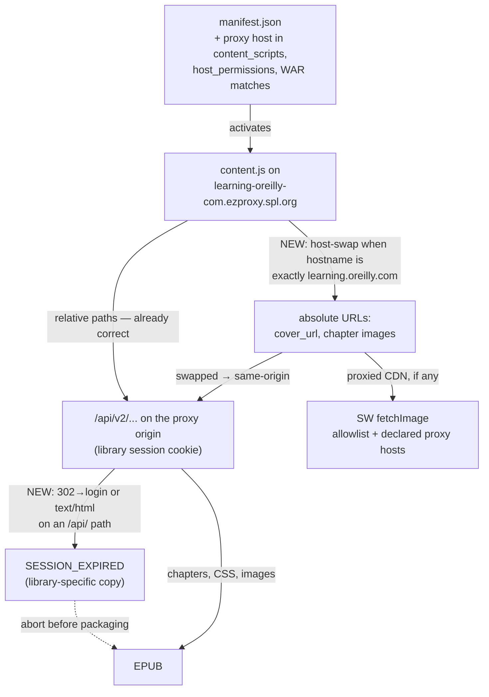

# feat: Library proxy (EZproxy) support

## Overview

The exporter today only activates on `learning.oreilly.com` — personal subscriptions. Library users reach the same content through hostname-rewriting proxies, e.g. `https://learning-oreilly-com.ezproxy.spl.org/library/view/python-crash-course/9781098156664/f01.xhtml` (Seattle Public Library). The paths, page structure, and `/api/v2/...` endpoints are identical; only the origin differs.

This plan adds the library proxy host as a **static manifest declaration**, then fixes the three things that actually break on a different origin: absolute `learning.oreilly.com` URLs baked into the pipeline, the SW image-proxy allowlist, and EZproxy's session-expiry mode (a 302-to-login that `fetch` follows into a 200 HTML page — which would otherwise be packaged into the EPUB as chapter content).

Adding a *different* library is then a one-line manifest edit, documented in the README. A runtime "Enable on this site" flow that would make arbitrary libraries work without editing the manifest was designed and costed during planning, then deliberately deferred — see Alternative Approaches Considered, which preserves its hazards so they don't have to be rediscovered.

## Problem Frame

Direct request from the user (no brainstorm doc; bootstrap): expand support from personal subscriptions to library access — "essentially the content are similar". The concrete target is SPL; the extension is installed via Load-unpacked for personal use, so a manifest edit is an acceptable per-library setup step.

What breaks on a proxy origin:

1. **Static host declarations.** `manifest.json` scopes `content_scripts`, `host_permissions`, and `web_accessible_resources` to `learning.oreilly.com`, so the extension is inert on the proxy host.
2. **Session locality.** The library session cookie lives on the proxy domain (`*.ezproxy.spl.org`); requests to the real `learning.oreilly.com` from the same browser are unauthenticated. Every absolute `learning.oreilly.com` URL in the pipeline (the cover-fallback base, API-returned `cover_url`, chapter-embedded absolute URLs) is a broken path in library mode.
3. **Proxy failure modes differ.** EZproxy session expiry is not a 401 — it is a 302 to `login.ezproxy.<lib>.org` that `fetch` follows to a 200 HTML login page. Unhandled, that HTML crashes manifest JSON parsing with a cryptic error, or worse, is silently written into the EPUB as a chapter.

What already works unchanged (verified by code scan): all API fetches are relative paths against the page origin; pagination `next` is converted to path+query before fetching; `Fetcher.extractIsbn` is path-anchored with no host dependency; all download state is keyed by tabId, not host.

## Requirements Trace

- R1. On the declared library proxy host, the extension activates and the full pipeline works: book detection, chapter/CSS/image fetching, cover fallback, quality report, notifications.
- R2. Absolute `learning.oreilly.com` URLs are normalized to the page origin, and images resolve whether the library's proxy rewrites the CDN or leaves it direct.
- R3. Proxy session expiry is detected and surfaced with library-specific guidance; a login page is never packaged into an EPUB and never misreported as a JSON/parse error.
- R4. Zero regression for direct `learning.oreilly.com` use: the existing 181-test suite stays green and generated output stays epubcheck-clean.
- R5. Supporting another library is a single documented manifest edit; OpenAthens/SSO libraries (which land users on the real `learning.oreilly.com` with an institutional session) already work with no changes.

## Scope Boundaries

- **No runtime permission UX.** No `optional_host_permissions`, no `chrome.scripting.registerContentScripts`, no "Enable on this site" popup flow. Users at other libraries edit one manifest line and reload the unpacked extension (README-documented). Rationale and the deferred design live in Alternative Approaches Considered.
- **One library declared out of the box** (SPL, the user's). Others are a manifest edit, not a code change.
- **https hostname-rewriting proxies only.** Proxy-by-port (`https://ezproxy.x.org:2443`) and http-only proxies are out of scope. WAM/MUSE-style rewriters may work if their hostname is declared, but their absolute-URL variants are untested and best-effort.
- **ToS posture unchanged:** the personal-use-only disclaimer applies equally to library access; the README gains a note. This plan does not assess individual libraries' terms.

## Context & Research

### Relevant Code and Patterns

- `oreilly-epub-extension/manifest.json` — three static host surfaces to extend: `content_scripts.matches`, `host_permissions`, `web_accessible_resources.matches`.
- `oreilly-epub-extension/content.js` — `fetchCoverFallback` normalizes `cover_url` against a hardcoded `https://learning.oreilly.com` base (the only absolute base in content code); the four-strategy image fallback's Strategy 4 hands absolute URLs to the SW proxy; `imageMap`/`chapterImageMap` keys are the original `src` strings consumed by `EinkOptimizer` for XHTML rewriting (host-swapping must never touch the keys); the eink CSS is fetched via `chrome.runtime.getURL().then(fetch)` at a single call site.
- `oreilly-epub-extension/lib/path-utils.js` — `isAllowedImageUrl`: exact-match `learning.oreilly.com`, dot-suffix `oreillystatic.com` / `safaribooksonline.com`. **Correction found during review:** this is enforced in the SW `fetchImage` handler (entry check + post-redirect re-validation); on the content side it is consulted **only** by `fetchCoverFallback` — Strategy 4 calls the SW with no local gate. The plan's allowlist changes follow from this, not from a symmetric two-sided gate.
- `oreilly-epub-extension/lib/fetcher.js` — `_fetchWithRetry` treats only HTTP 401 as `SESSION_EXPIRED`; `extractIsbn` is path-anchored (`/\/library\/(?:view|cover)\/.../`) and proxy-safe as-is.
- `oreilly-epub-extension/background.js` — message switch, guarded lifecycle handlers, `fetchImage` with two allowlist checkpoints.
- Test harness: `oreilly-epub-extension/tests/chrome-mock.js` (message routing, storage, badges, notifications, ports); `tests/epub-compliance.test.js` (full-pipeline fixtures); `tests/popup-preview.html` (popup visuals).

### Institutional Learnings

- `docs/solutions/` does not exist. Project memory applies: bust the browser-test cache with a fresh port; JSON `\u` escapes decode to raw characters in tool args (write such content via Python); every SW message handler must `sendResponse` or an awaited `dispatchTo` hangs.

### External References

- **EZproxy mechanics** (OCLC docs + live probe of `ezproxy.spl.org`): hostname rewriting confirmed — `learning.oreilly.com` → `learning-oreilly-com.<proxyhost>`, dots→hyphens so the wildcard cert `*.ezproxy.spl.org` matches; **path preserved verbatim**. EZproxy ≥6.0.8 rewrites URLs inside JSON responses by default, so `cover_url` / pagination `next` may arrive already-proxied — normalization must be idempotent. The session cookie lives on the proxy domain; O'Reilly's own cookies are held server-side by EZproxy. The O'Reilly stanza is customized per library and not public, so whether `*.oreillystatic.com` is proxied (as `cdn-oreillystatic-com.<proxyhost>`) or left direct is per-library and only knowable by observation. Docs: help.oclc.org (Option HttpsHyphens, About URL rewriting, MimeFilter, Option Cookie, LoginCookieDomain).
- **Prior art:** no existing O'Reilly export tool handles EZproxy. Zotero Connector's proxy support (infer the scheme from a visited URL rather than enumerating) is the reference design for the deferred runtime approach.

## Key Technical Decisions

- **Static manifest declaration, not runtime permissions** (user decision): the extension is load-unpacked and personal; one known library is in scope. Declaring `https://learning-oreilly-com.ezproxy.spl.org/*` alongside the existing host costs one line and zero new machinery, where the runtime-permission design cost two implementation units, a new SW lifecycle (`reconcile()`), an injection sentinel, and a permission-scoped rewrite of the image proxy. Consequence that shapes everything below: **content scripts only ever run on hosts we chose**, so there is no untrusted-granted-origin threat model.
- **Allowlist gains the declared proxy hosts, keeping target-URL authorization**: `isAllowedImageUrl` accepts the proxy book host and (if Unit 1 shows it is used) the proxied CDN host, as exact matches. Sender-scoped authorization — required by the runtime design, because there any granted origin could have driven the SW to fetch the user's personal `learning.oreilly.com` session — is **not** needed here: every origin the content script runs on is one we declared. The post-redirect re-validation stays as-is.
- **Origin normalization is a pure helper, idempotent and narrow**: swap the host to `location.origin` only when the URL's hostname is exactly `learning.oreilly.com` and the page origin differs. URLs EZproxy already rewrote don't match the condition and pass through untouched; CDN/S3 hosts are never touched. The swap affects only the fetch URL — `imageMap` keys stay the original `src`, so XHTML rewriting is unaffected. A swapped absolute URL becomes same-origin and takes the relative/API path (Strategy 3), never the SW proxy.
- **`fetchCoverFallback` defers absolute URLs to the SW.** Its local allowlist check must go: an *already-proxied* `cover_url` (`cdn-oreillystatic-com.<suffix>`) is neither same-origin nor on the pre-change static list, so a local gate would reject a cover the SW would have allowed. The SW remains the single enforcement point; fail-closed semantics are unchanged (SW refuses → `null` → coverless EPUB).
- **Proxy session-expiry detection in `_fetchWithRetry`**: treat as `SESSION_EXPIRED` when (a) HTTP 401 (existing), or (b) the response was redirected and the final URL's origin left the request origin (or landed on a `login.`-prefixed host), or (c) an `/api/` request answers with `Content-Type: text/html`. Error copy branches on the page origin: direct → "log in to O'Reilly"; proxy → "your library session expired — sign in through your library's portal again". This is the highest-value correctness fix in the plan: without it a login page is silently packaged as a chapter, exactly the class of failure the quality gate exists to prevent.
- **eink CSS: broaden `web_accessible_resources.matches` to the declared hosts** (user decision). A content script cannot fetch a WAR resource from an origin outside `matches`. Since the origins are known statically, adding them to `matches` is a one-line fix — no new SW message action, no path-guard, no migration of the seven `eink-override.css` fetch stubs across the test suites. `chrome.scripting.insertCSS` is not an alternative: this resource is embedded as *text* into the EPUB ZIP, not applied to the page.
- **Live calibration before code** (user decision — SPL credentials available): Unit 1 settles what research could not — whether the CDN is proxied (decides one manifest line and one allowlist entry), whether JSON URLs arrive rewritten, and the exact shape of an expired session.

## Open Questions

### Resolved During Planning

- Generality: static declaration now; runtime permission flow deferred with its design recorded (user decision).
- Sender-scoped SW authorization: unnecessary under static declaration — no untrusted origins run our code. (It would be mandatory if the runtime flow is ever built; recorded in Alternatives.)
- Parent-wildcard grant / two-step confirmation UX: moot — no grants exist.
- CSS delivery: broaden WAR matches rather than remove WAR (user decision).
- Live verification: yes, Unit 1, before the code units (user decision).

### Deferred to Implementation

- Whether the proxied CDN host (`cdn-oreillystatic-com.ezproxy.spl.org`) needs declaring at all — Unit 1 observes SPL's actual routing and decides one manifest line plus one allowlist entry. If the CDN is direct, nothing is added.
- The exact redirect conditions that mark expiry (final-host prefix vs origin change vs both) — calibrated against Unit 1's observed chain, then pinned by tests.
- Whether `document.title` on proxied pages keeps the `"Chapter | Book"` shape the title fallback expects (EZproxy does not rewrite titles; confirm during Unit 1).

## High-Level Technical Design

> *This illustrates the intended approach and is directional guidance for review, not implementation specification. The implementing agent should treat it as context, not code to reproduce.*

The pipeline is already origin-relative; only the marked edges need work.

Everything else — attemptId guards, `reportByTab`, notifications, the quality gate — is keyed by tabId and host-agnostic, so it inherits proxy support for free.

## Implementation Units

- [ ] **Unit 1: Live proxy calibration (SPL session)**

**Goal:** Replace the three research blind spots with observed facts before code is written against assumptions.

**Requirements:** R2, R3 (calibration input)

**Dependencies:** The user's Chrome with an active SPL session (coordinate as with the prior live O'Reilly API verification).

**Files:**
- Modify: `docs/plans/2026-07-09-002-feat-library-proxy-support-plan.md` (record observations in a Calibration Findings appendix)

**Approach:**
- On a logged-in proxied book page, observe via DevTools and scripted fetches: (a) `/api/v2/search/` and `/api/v2/epubs/.../files/` return complete JSON under the institutional session; (b) the actual form of `filesData.next` and `cover_url` — real host or already-proxied (JSON-rewrite actuality); (c) how chapter HTML references images (relative / absolute-real / absolute-proxied) and whether `cdn.oreillystatic.com` assets arrive direct or as `cdn-oreillystatic-com.ezproxy.spl.org` — **this decides whether the CDN host is declared at all**; (d) session-expiry behavior after logout or timeout on an API path: full redirect chain, final host, status codes, response `Content-Type`; (e) `document.title` shape on a proxied chapter page.
- Record each observation as confirmed / contradicted against the research summary, and update Unit 2's manifest line count and Unit 3's expiry conditions accordingly.

**Test scenarios:**
- Test expectation: none — observation-only unit; its deliverable is the calibration appendix.

**Verification:**
- The appendix answers all five probes with observed values, each marked confirmed or contradicted, and names the concrete downstream change (declare the CDN host or not; the exact expiry predicate).

- [ ] **Unit 2: Declare the proxy host; normalize origins; extend the allowlist**

**Goal:** The extension activates on the SPL proxy origin and every absolute-URL path in the pipeline resolves against it.

**Requirements:** R1, R2

**Dependencies:** Unit 1 (CDN routing decides whether the CDN host is declared)

**Files:**
- Modify: `oreilly-epub-extension/manifest.json` (add the proxy book host — and, only if Unit 1 showed it is used, the proxied CDN host — to `content_scripts.matches`, `host_permissions`, and `web_accessible_resources.matches`)
- Modify: `oreilly-epub-extension/lib/path-utils.js` (pure host-swap helper; `isAllowedImageUrl` gains the declared proxy hosts)
- Modify: `oreilly-epub-extension/content.js` (cover base + drop the local cover gate; pre-Strategy-4 swap)
- Test: `oreilly-epub-extension/tests/path-utils.test.js`
- Test: `oreilly-epub-extension/tests/content-lifecycle.test.js`
- Test: `oreilly-epub-extension/tests/epub-compliance.test.js` (proxy-origin fixture)

**Approach:**
- Host-swap helper: swap only when the URL's hostname is exactly `learning.oreilly.com` and the page origin differs; idempotent on already-proxied URLs; never touches other hosts.
- `fetchCoverFallback`: resolve `cover_url` against `location.origin` instead of the hardcoded base, and remove its local `isAllowedImageUrl` check so an already-proxied cover reaches the SW (which is the enforcement point). Fail-closed behavior is unchanged.
- Chapter images: swap absolute `learning.oreilly.com` URLs to the page origin *before* the Strategy-4 branch, so they become same-origin and take Strategy 3. `imageMap` / `chapterImageMap` keys stay the original `src` — `EinkOptimizer` rewrites XHTML from them.
- `isAllowedImageUrl`: add the declared proxy hosts as exact matches, alongside the existing entries. The existing manifest-sync test must be extended to cover the new hosts.
- The `path-utils.test.js` manifest-sync test is the guard that keeps `host_permissions` and the allowlist from drifting when a future user adds their own library.

**Patterns to follow:**
- `PathUtils` pure-helper style with `_`-prefixed privates and dedicated unit tests; the existing `isAllowedImageUrl` exact-vs-dot-suffix distinction (never substring matching); `tests/epub-compliance.test.js`'s `buildEpubWith` harness for a full-pipeline fixture on a mocked proxy origin.

**Test scenarios:**
- Happy path: host-swap of `https://learning.oreilly.com/api/x` with a proxy page origin → proxied URL; an already-proxied URL → unchanged (idempotent); `https://cdn.oreillystatic.com/x` → unchanged; direct mode (origin is the real host) → unchanged.
- Edge case: relative and protocol-relative `cover_url` on a proxied page → resolve against the proxy origin, not the real host.
- Happy path (allowlist): the declared proxy book host and (if declared) the proxied CDN host are accepted; `learning-oreilly-com.ezproxy.spl.org.evil.example` is rejected (exact match, no suffix confusion); `http://` of a declared host is rejected.
- Edge case (allowlist): the manifest-sync test fails if a host is added to `host_permissions` but not to `isAllowedImageUrl` (and vice versa).
- Integration: full mocked download on a proxy origin → cover_url arriving in real-host form is fetched same-origin and packaged; the same run with an already-proxied `cover_url` produces the same EPUB (regression against the removed local gate).
- Integration: an absolute real-host chapter image on a proxied page → downloaded via Strategy 3 with no SW call, XHTML rewritten via the original `src` key, no orphan resource (compliance harness).
- Integration (regression): the direct-mode compliance fixture produces a byte-comparable EPUB and makes the same `fetchImage` decisions as before.

**Verification:**
- New unit and integration tests green; the full suite green; a proxied-origin mocked run yields an epubcheck-clean EPUB with images and cover resolved.

- [ ] **Unit 3: Proxy session-expiry detection**

**Goal:** An expired library session aborts the download with library-specific guidance instead of packaging a login page.

**Requirements:** R3

**Dependencies:** Unit 1 (observed expiry shape)

**Files:**
- Modify: `oreilly-epub-extension/lib/fetcher.js`
- Modify: `oreilly-epub-extension/content.js` (error copy branches on origin)
- Test: `oreilly-epub-extension/tests/fetcher.test.js`
- Test: `oreilly-epub-extension/tests/content-lifecycle.test.js`

**Approach:**
- `_fetchWithRetry` gains expiry detection beyond 401: a redirected response whose final URL left the request origin (or landed on a `login.`-prefixed host) throws `SESSION_EXPIRED`; secondary guard: an `/api/` request answered with `Content-Type: text/html` throws the same. Exact predicates calibrated against Unit 1's observed chain.
- Content's session-expired message branches on whether `location.origin` is the real host — the proxy variant tells the user to sign back in through the library portal.
- Chapter fetches already treat `SESSION_EXPIRED` as fatal (the rethrow guards added by the quality-gate work), so once the throw happens at fetch level no login-page bytes can reach the ZIP.

**Execution note:** Test-first — the failure modes are crisp and mock-expressible (`response.url`, `response.redirected`, headers).

**Test scenarios:**
- Happy path: HTTP 401 still throws `SESSION_EXPIRED` (regression).
- Happy path: a redirected response landing on `login.ezproxy.spl.org` → `SESSION_EXPIRED`; a redirected response staying same-origin (an ordinary API redirect) → not expired.
- Edge case: redirect to another allowed O'Reilly host in direct mode → behavior chosen from Unit 1's observation and pinned by the test.
- Error path: an `/api/` request returning 200 with `Content-Type: text/html` → `SESSION_EXPIRED`, not a JSON parse crash.
- Integration: expiry mid-download (a chapter fetch returns the login redirect) → `downloadError` with `errorKind: 'session'`, the partial quality report intact, no EPUB delivered, and the popup shows the library-variant copy on a proxied-origin fixture.
- Integration: no login-page bytes appear anywhere in a ZIP produced during an expiry run.

**Verification:**
- Fetcher suite green with the new cases; the integration fixture proves no login HTML reaches the ZIP; direct-mode 401 handling unchanged.

- [ ] **Unit 4: Regression, docs, and live end-to-end**

**Goal:** Direct-mode zero-regression proven; library support documented; one real proxied book exported and validated.

**Requirements:** R4, R5

**Dependencies:** Units 2–3

**Files:**
- Modify: `README.md` (Library access section: which host is declared, how to add your own library, unsupported proxy types, OpenAthens note, ToS reminder)
- Modify: `CLAUDE.md` (architecture notes: declared proxy hosts, origin normalization, expiry detection, and the allowlist/manifest sync invariant)
- Test: full suite + epubcheck gate

**Approach:**
- Full browser suite on a fresh port; epubcheck 5.1.0 against both a direct-mode fixture EPUB and a proxied-origin fixture EPUB; live end-to-end on the SPL proxy (load unpacked → open the Python Crash Course chapter → download → epubcheck the artifact → spot-check cover and images).
- README documents the one-line manifest edit for other libraries, and that OpenAthens/SSO libraries need no change because they land on the real host.

**Test scenarios:**
- Test expectation: none beyond the suites above — this unit is verification and documentation.

**Verification:**
- Suite green; both epubcheck runs report 0 fatals / 0 errors / 0 warnings; the live SPL export succeeds and validates; docs updated.

## System-Wide Impact

- **Interaction graph:** no new message actions, listeners, or state fields. The change surface is three manifest arrays, one pure helper, two call sites in `content.js`, and one predicate in `fetcher.js`.
- **Error propagation:** `SESSION_EXPIRED` semantics widen (redirect and content-type detection) but flow through the existing `errorKind: 'session'` path — quality report, notification, and popup copy all inherit it; only the copy branches by origin.
- **Security boundary:** unchanged in kind. Content scripts run only on statically declared hosts, so the SW's target-URL authorization remains sound; the allowlist grows by exactly the hosts the manifest declares, and the manifest-sync test keeps the two in step. Adding a host to `host_permissions` without adding it to `isAllowedImageUrl` (or vice versa) fails a test rather than silently opening or breaking the credentialed proxy.
- **State lifecycle risks:** none new. `bookInfoByTab`, `reportByTab`, and the attemptId guards are keyed by tabId and host-agnostic.
- **API surface parity:** `fetchCoverFallback` stops consulting the allowlist locally, leaving the SW as the single enforcement point — a simplification, not a new asymmetry.
- **Integration coverage:** a proxied-origin compliance fixture proves the pipeline end-to-end without a live session; the live SPL run covers what mocks cannot (stanza behavior, real expiry chain).
- **Unchanged invariants:** relative-path API fetching; the frozen `bookDetected` payload; attemptId guards and report lifecycle; direct-mode `fetchImage` decisions; epubcheck-clean output; single-download-at-a-time; `EinkOptimizer`'s dependence on original `src` keys.

## Alternative Approaches Considered

**Runtime host permissions + dynamic content-script registration** (designed in full, then deferred). It would let *any* library work with an in-popup "Enable on this site" click, no manifest edit: `optional_host_permissions: ["https://*/*"]`, a narrow `permissions.request` inside the click gesture, and `chrome.scripting.registerContentScripts` for durability. Rejected for now because the extension is load-unpacked and personal, one library is in scope, and the design carries real hazards that a manifest line does not. Recording them here so a future implementer inherits the analysis rather than repeating it:

- **The SW image proxy becomes a confused deputy.** Once content scripts can run on an arbitrary granted origin, the existing target-URL allowlist lets a script on *any* granted origin drive a `credentials: 'include'` fetch to `learning.oreilly.com` and receive the user's **personal** session bytes. Authorization would have to be scoped by `sender.origin` (fail-closed when absent) plus an O'Reilly host-shape check on the target, and credentialed fetches would have to refuse cross-first-party redirects. Non-negotiable prerequisite.
- **Hostname heuristics are not a security control.** `learning-oreilly-com.evil.com` matches both the "contains oreilly" enable heuristic *and* the EZproxy derivation shape, so a naive flow would offer the primary button and derive a `https://*.evil.com/*` grant. The parent wildcard (needed only to cover a proxied CDN, which is a *different origin* from the book page) must never be one autopilot click from a look-alike host.
- **`content.js` re-executes silently on double injection.** It is an IIFE with no top-level declarations, so a second execution does not throw the way the lib files' `const`s do — it registers a second `onMessage` listener with its own `abortController`, and one `startDownload` runs two concurrent downloads under one attemptId. A sentinel belongs **inside `content.js` only**; a chain-wide guard would break the first injection and the single-load test harness.
- **Registrations must be derived, not written.** Dynamic registrations survive browser restarts but not extension reloads, while grants persist; a grant made from `chrome://extensions` may never reach the popup. The only self-healing shape is a `reconcile()` that diffs `permissions.getAll()` against `getRegisteredContentScripts()` at every SW start, with ids and matches as pure functions of the *granted pattern* (a hostname-derived id cannot be reproduced at reconcile time).
- **Revocation cleanup must not use `tabs.query`.** Once the permission is gone the extension can no longer see those tabs' URLs, so cleanup keyed on a live query silently no-ops exactly when it is needed. The tab's origin has to be stamped into `bookInfoByTab` at detection time.

**Removing `web_accessible_resources` in favor of an SW-served resource message.** Rejected: the eink CSS is non-sensitive static text, `matches` accepts the declared hosts directly, and the message route would add a new action, a path-guard, a failure mode, and a migration of seven `eink-override.css` fetch stubs across two test suites.

## Risks & Dependencies

| Risk | Mitigation |
|------|------------|
| SPL's private stanza doesn't proxy a path the pipeline needs (e.g. `/api/v2/`) → downloads impossible at that library | Unit 1 verifies end-to-end before any code is written; the failure mode is a clean `SESSION_EXPIRED`-style error, not corruption; documented as per-library variance |
| **Login page packaged as chapter content** — the pre-existing, highest-severity failure this plan closes | Unit 3's redirect + content-type detection throws at the fetch layer, where the quality gate's existing rethrow guards already treat `SESSION_EXPIRED` as fatal; an integration test asserts no login HTML reaches the ZIP |
| Expiry heuristics false-positive on legitimate redirects (locale bounces, A/B) | Predicates calibrated against Unit 1's observed chain; same-origin redirects never trigger; tests pin the chosen behavior |
| A future user adds their library to `host_permissions` but not to `isAllowedImageUrl`, silently breaking image fetches (or vice versa, silently widening the credentialed proxy) | The existing manifest-sync test is extended to cover every declared host in both directions; README's "add your library" instructions name both places |
| Proxied CDN discovered later at another library, though absent at SPL | The allowlist and manifest take exact hosts, so it is the same one-line addition; nothing in the design assumes the CDN is direct |
| Host-swap corrupts `imageMap` keys and breaks XHTML rewriting | The swap is applied to the fetch URL only, never to map keys; an integration test asserts the rewritten XHTML still points at the packaged filename |

## Documentation / Operational Notes

- README gains a "Library access" section: the declared host, the one-line edit for another library (naming both `manifest.json` and `lib/path-utils.js`), unsupported proxy types, and the OpenAthens note.
- CLAUDE.md records the origin-normalization rule, the expiry predicate, and the manifest↔allowlist sync invariant.
- The Unit 1 calibration appendix doubles as the institutional record of SPL-observed proxy behavior — the only place this repo will have observed EZproxy facts.

## Sources & References

- Related code: `oreilly-epub-extension/manifest.json`, `oreilly-epub-extension/content.js` (`fetchCoverFallback`, image strategies), `oreilly-epub-extension/lib/path-utils.js` (`isAllowedImageUrl`), `oreilly-epub-extension/lib/fetcher.js` (`_fetchWithRetry`, `extractIsbn`), `oreilly-epub-extension/background.js` (`fetchImage`)
- Related plans: `docs/plans/2026-07-09-001-feat-download-quality-gate-plan.md` (the report, `errorKind`, and rethrow-guard surfaces this plan reuses)
- External docs: help.oclc.org — EZproxy Option HttpsHyphens / About URL rewriting / MimeFilter / Option Cookie / LoginCookieDomain; developer.chrome.com — content-scripts, web-accessible-resources, network-requests (content scripts fetch as the page origin)
- Example target: `https://learning-oreilly-com.ezproxy.spl.org/library/view/python-crash-course/9781098156664/f01.xhtml`
